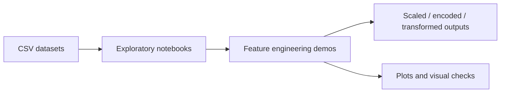
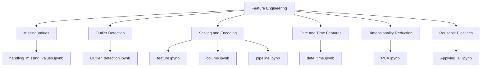

# Feature Engineering Notes

This folder is a compact feature-engineering practice workspace. It combines small exploratory notebooks, preprocessing pipelines, and several tabular datasets used for hands-on machine learning experiments.

## Workspace Map

## Files In This Folder

| File | Type | Purpose |
| --- | --- | --- |
| `Applying_all.ipynb` | Notebook | End-to-end practice notebook using the Adult income dataset. It walks through data loading, inspection, encoding, scaling, plotting, and feature preparation. |
| `colums.ipynb` | Notebook | Titanic preprocessing draft focused on column selection, imputing missing values, and building a `ColumnTransformer` pipeline. |
| `date_time.ipynb` | Notebook | Date and time feature extraction notebook that derives hour, minute, AM/PM, time period, and elapsed-time style features from timestamps. |
| `feature.ipynb` | Notebook | Feature scaling and outlier-style exploration on the Social Network Ads dataset, including scatter plots, box plots, and standardized features. |
| `handling_missing_values.ipynb` | Notebook | Missing-value handling practice notebook using toy examples and Titanic-style data to demonstrate complete-case analysis and missing-value summaries. |
| `Outlier_detection.ipynb` | Notebook | Outlier analysis on the college placement dataset using IQR, capping, trimming, and Z-score based cleanup. |
| `PCA.ipynb` | Notebook | Principal Component Analysis notebook built on the red wine quality dataset with visual and numerical dimensionality-reduction steps. |
| `pipeline.ipynb` | Notebook | A more complete Titanic preprocessing pipeline that combines imputation, encoding, scaling, train/test split, and model-ready feature preparation. |
| `adult.csv` | Dataset | Adult income classification data with demographic, work, and education features. |
| `college_student_placement_dataset.csv` | Dataset | Student placement-style dataset with academic, communication, internship, and extracurricular features. |
| `Social_Network_Ads.csv` | Dataset | Social network advertising dataset with age, salary, gender, and purchase label columns. |
| `Titanic-Dataset.csv` | Dataset | Classic Titanic survival dataset with passenger, ticket, cabin, and survival fields. |
| `winequality-red.csv` | Dataset | Red wine physicochemical measurements with quality labels. |

## Notebook Topics

## Visual Notes

The notebooks already contain plots and exploratory outputs such as scatter plots, box plots, and PCA visualizations. If you want this README to include exported images later, the cleanest approach is to save notebook figures into an `images/` folder and embed them here with standard Markdown image links.

## Quick Summary By File

- `handling_missing_values.ipynb`: demonstrates identifying nulls, measuring missingness, and dropping incomplete rows.
- `pipeline.ipynb`: shows how to combine preprocessing steps into a scikit-learn pipeline for Titanic survival modeling.
- `PCA.ipynb`: explores variance structure in the wine-quality dataset and reduces feature dimensionality.
- `feature.ipynb`: investigates scaling and outliers on salary data and compares raw vs transformed values.
- `Outlier_detection.ipynb`: compares IQR capping, trimming, and Z-score methods on placement data.
- `date_time.ipynb`: builds reusable datetime-derived features from timestamps.
- `colums.ipynb`: experiments with per-column preprocessing on Titanic data.
- `Applying_all.ipynb`: collects broader preprocessing examples in one place for the Adult dataset.

## Suggested Next Step

If you want, I can also turn this into a more polished portfolio-style README with:

1. a cover section and learning objectives,
2. embedded charts exported from the notebooks,
3. a cleaner table of contents and navigation links.