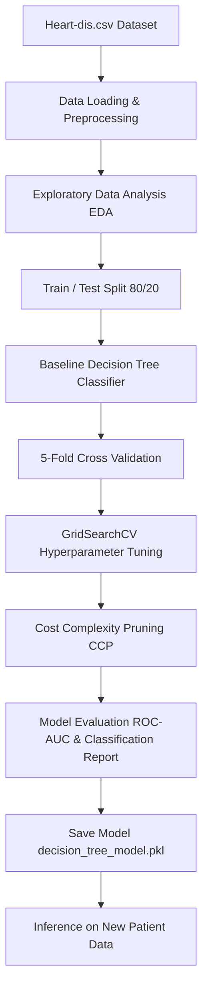
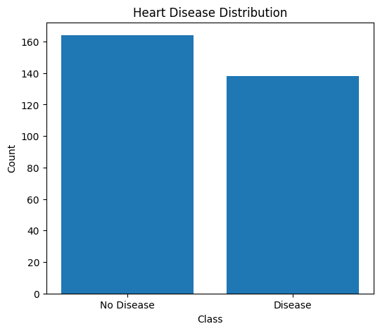
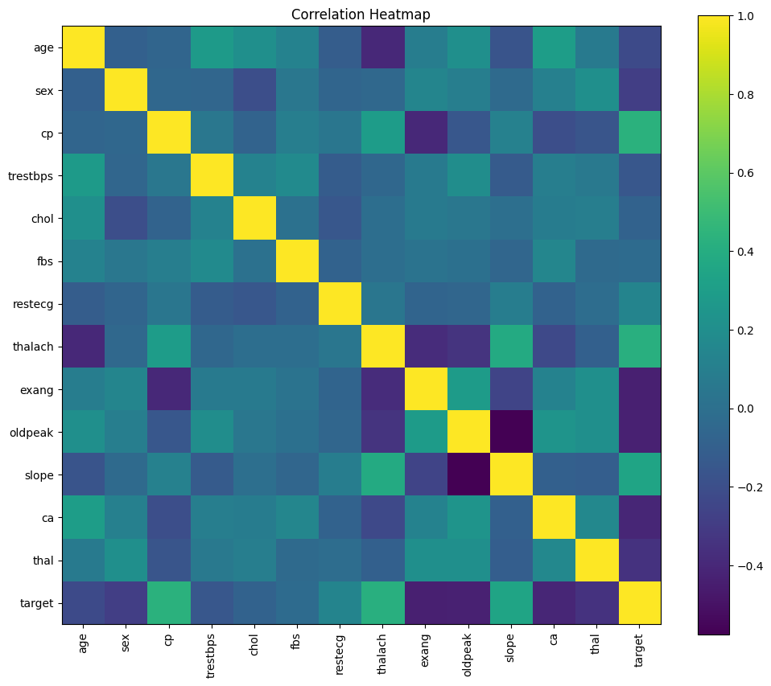
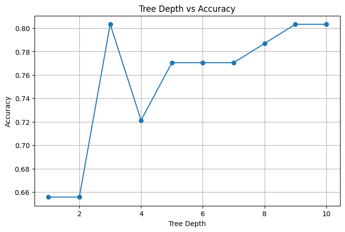
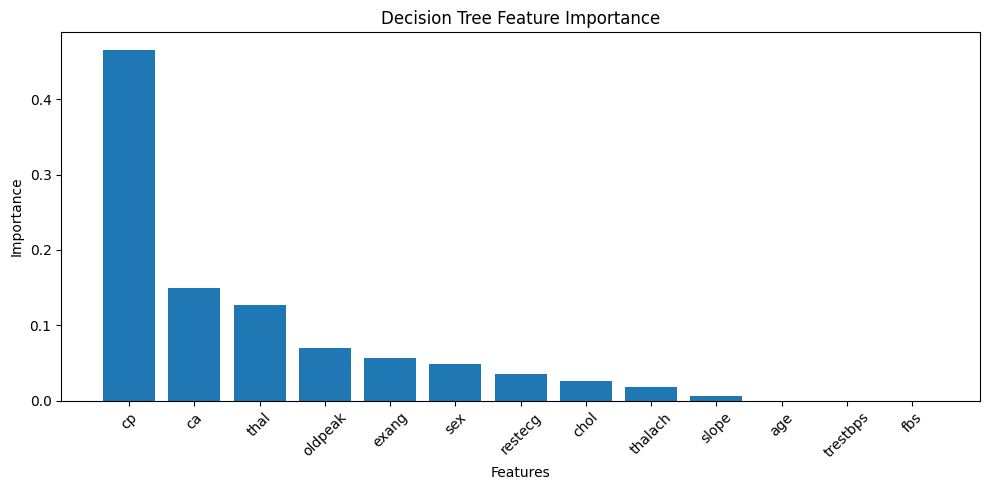
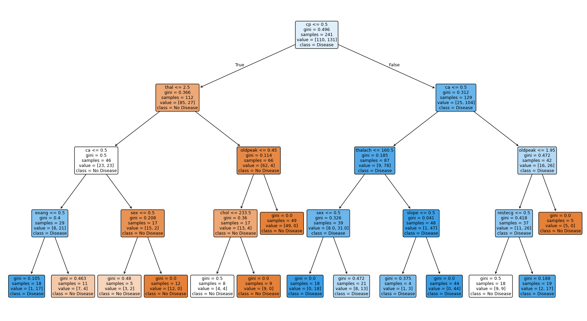
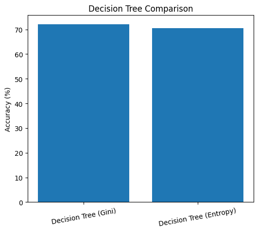
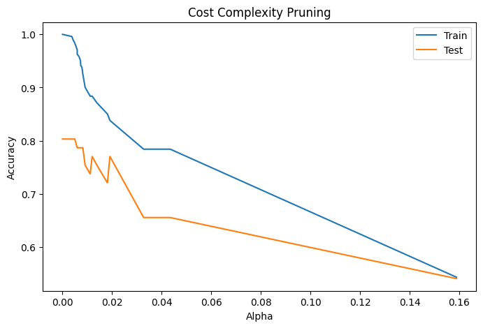
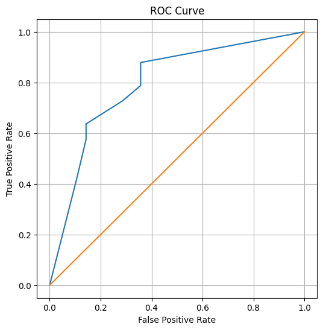

# 🌳 Heart Disease Classification using Decision Tree

An end-to-end Machine Learning project demonstrating data preprocessing, Exploratory Data Analysis (EDA), Decision Tree modeling, hyperparameter optimization via GridSearchCV, Cost Complexity Pruning (CCP), model visualization, and model serialization.

---

## 📌 Table of Contents
- [Project Overview](#-project-overview)
- [Dataset Description](#-dataset-description)
- [Project Architecture](#-project-architecture)
- [Exploratory Data Analysis (EDA)](#-exploratory-data-analysis-eda)
- [Model Training & Hyperparameter Tuning](#-model-training--hyperparameter-tuning)
- [Model Evaluation & Metrics](#-model-evaluation--metrics)
- [Feature Importance](#-feature-importance)
- [Decision Tree Visualizations](#-decision-tree-visualizations)
- [Cost Complexity Pruning & ROC Analysis](#-cost-complexity-pruning--roc-analysis)
- [Model Deployment & Inference](#-model-deployment--inference)
- [Project Structure](#-project-structure)
- [How to Run](#-how-to-run)

---

## 🎯 Project Overview

This project builds a predictive Machine Learning model using **Decision Tree Classifiers** to diagnose the presence of **Heart Disease** based on clinical indicators. 

### Key Project Achievements:
- 📊 **Comprehensive EDA**: Visualized target distributions, feature histograms, boxplots, and correlation heatmaps.
- ⚙️ **Hyperparameter Optimization**: Used `GridSearchCV` to determine optimal tree depth, split criteria, and leaf node constraints.
- 📈 **Performance Evaluation**: Achieved **82.59%** cross-validation accuracy and an **ROC-AUC score of 0.796**.
- 🔍 **Interpretability**: Extracted feature importance metrics and rendered high-resolution decision tree diagrams.
- 💾 **Model Persistence**: Serialized the best performing model using `joblib` and created a pipeline for real-time inference on new patient data.

---

## 📋 Dataset Description

The dataset `Heart-dis.csv` consists of **302 records** and **14 clinical attributes** used to predict cardiac health.

| Feature Name | Description | Value Type |
| :--- | :--- | :--- |
| `age` | Patient age in years | Numerical |
| `sex` | Gender (1 = Male, 0 = Female) | Categorical |
| `cp` | Chest Pain Type (0: Typical Angina, 1: Atypical Angina, 2: Non-anginal, 3: Asymptomatic) | Categorical |
| `trestbps` | Resting blood pressure (in mm Hg on admission to hospital) | Numerical |
| `chol` | Serum cholesterol in mg/dl | Numerical |
| `fbs` | Fasting blood sugar > 120 mg/dl (1 = True, 0 = False) | Categorical |
| `restecg` | Resting electrocardiographic results (0, 1, 2) | Categorical |
| `thalach` | Maximum heart rate achieved | Numerical |
| `exang` | Exercise induced angina (1 = Yes, 0 = No) | Categorical |
| `oldpeak` | ST depression induced by exercise relative to rest | Numerical |
| `slope` | Slope of the peak exercise ST segment | Categorical |
| `ca` | Number of major vessels (0-3) colored by fluoroscopy | Numerical |
| `thal` | Thalassemia status (1 = Normal, 2 = Fixed Defect, 3 = Reversible Defect) | Categorical |
| **`target`** | **Heart Disease Diagnosis (1 = Disease Present, 0 = No Disease)** | **Binary Target** |

---

## 🏗️ Project Architecture



---

## 📊 Exploratory Data Analysis (EDA)

### Target Distribution
The dataset contains a balanced distribution of cardiac patients and healthy individuals.



### Feature Correlation Heatmap
Analysis of feature correlations highlights strong relationships between `cp` (Chest Pain Type), `thalach` (Max Heart Rate), `exang` (Exercise Induced Angina), and the presence of Heart Disease (`target`).



---

## ⚙️ Model Training & Hyperparameter Tuning

### Baseline vs. Tuned Model
A `DecisionTreeClassifier` was trained and evaluated across various depths and splitting criteria (Gini Impurity vs. Information Entropy).

### Max Depth Comparison
Evaluating test accuracy across decision tree depths (1 through 10):



### Optimal Hyperparameters (via `GridSearchCV`)
Grid search was conducted over 108 parameter combinations using 5-fold cross-validation:

```python
parameters = {
    "criterion": ["gini", "entropy"],
    "max_depth": [2, 3, 4, 5, 6, None],
    "min_samples_split": [2, 5, 10],
    "min_samples_leaf": [1, 2, 4]
}
```

**Best Hyperparameters Identified:**
- `criterion`: **`entropy`**
- `max_depth`: **`5`**
- `min_samples_leaf`: **`4`**
- `min_samples_split`: **`2`**

---

## 📈 Model Evaluation & Metrics

### Performance Metrics Summary

| Metric | Score |
| :--- | :--- |
| **Best CV Accuracy** | **82.59%** |
| **Test Accuracy** | **72.13%** |
| **ROC AUC Score** | **0.796** |
| **Mean 5-Fold CV** | **76.15%** |

### Classification Report (Test Set)
```text
              precision    recall  f1-score   support

           0       0.69      0.71      0.70        28
           1       0.75      0.73      0.74        33

    accuracy                           0.72        61
   macro avg       0.72      0.72      0.72        61
weighted avg       0.72      0.72      0.72        61
```

---

## 🌟 Feature Importance

Feature importance weights demonstrate which clinical parameters have the highest influence on decision rules:

| Feature | Description | Importance Weight |
| :--- | :--- | :--- |
| **`cp`** | Chest Pain Type | **0.4657 (46.57%)** |
| **`ca`** | Major Vessels Fluoroscopy | **0.1490 (14.90%)** |
| **`thal`** | Thalassemia Status | **0.1273 (12.73%)** |
| **`oldpeak`** | ST Depression | **0.0699 (6.99%)** |
| **`exang`** | Exercise Induced Angina | **0.0560 (5.60%)** |
| **`sex`** | Gender | **0.0480 (4.80%)** |
| **`restecg`** | Resting ECG | **0.0350 (3.50%)** |
| **`chol`** | Cholesterol | **0.0258 (2.58%)** |
| **`thalach`** | Max Heart Rate | **0.0178 (1.78%)** |



---

## 🌲 Decision Tree Visualizations

### Tree Structure Diagram
Below is the full architecture of the trained decision tree showing splitting nodes, criteria thresholds, and class probabilities at leaf nodes.



### Initial Decision Tree Diagram


---

## ✂️ Cost Complexity Pruning & ROC Analysis

### Cost Complexity Pruning (CCP Alpha vs Accuracy)
Pruning avoids overfitting by controlling tree complexity with the cost-complexity parameter $\alpha$:



### Receiver Operating Characteristic (ROC Curve)
The model exhibits solid predictive capability with an **AUC score of 0.796**.



---

## 🧪 Model Deployment & Inference

### Real-Time Inference Code Example
The trained model is exported as `decision_tree_model.pkl` and loaded to perform real-time predictions for new patient profiles:

```python
import joblib
import pandas as pd

# Load saved Decision Tree model
model = joblib.load("decision_tree_model.pkl")

# Define new patient features
new_patient = pd.DataFrame([{
    "age": 52,
    "sex": 1,
    "cp": 0,
    "trestbps": 140,
    "chol": 230,
    "fbs": 0,
    "restecg": 1,
    "thalach": 150,
    "exang": 0,
    "oldpeak": 1.2,
    "slope": 2,
    "ca": 0,
    "thal": 2
}])

# Predict diagnosis
prediction = model.predict(new_patient)
probability = model.predict_proba(new_patient)

print(f"Prediction: {'Heart Disease Detected' if prediction[0] == 1 else 'No Heart Disease'}")
print(f"Probability: {probability}")
```

**Output Result:**
```text
Prediction : 1
Probability : [[0. 1.]]
Result : Heart Disease Detected
```

---

## 📁 Project Structure

```text
Decision-Tree/
│
├── Decision_Tree.ipynb       # Main Jupyter Notebook containing complete pipeline
├── Heart-dis.csv             # Input Heart Disease dataset
├── README.md                 # Complete project documentation
├── decision_tree_model.pkl   # Serialized best Decision Tree model (joblib)
├── feature_importance.csv    # Exported feature importance metrics
│
└── images/                   # Generated visualization plots
    ├── target_distribution.png
    ├── correlation_heatmap.png
    ├── initial_decision_tree.png
    ├── feature_importance.png
    ├── decision_tree_structure.png
    ├── max_depth_analysis.png
    ├── cost_complexity_pruning.png
    └── roc_curve.png
```

---

## 🚀 How to Run

### 1. Prerequisites
Ensure Python 3.8+ and the following libraries are installed:
```bash
pip install numpy pandas matplotlib seaborn scikit-learn joblib
```

### 2. Run Notebook
Launch Jupyter Notebook or Jupyter Lab:
```bash
jupyter notebook Decision_Tree.ipynb
```

---

## 📝 License
This project is open-source and available under the [MIT License](LICENSE).
