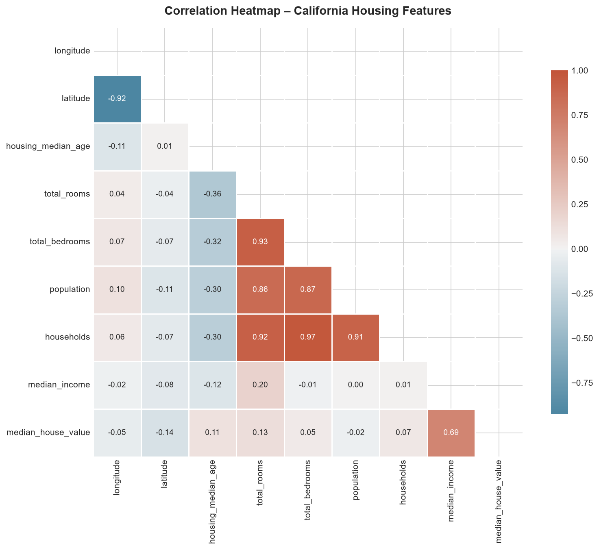
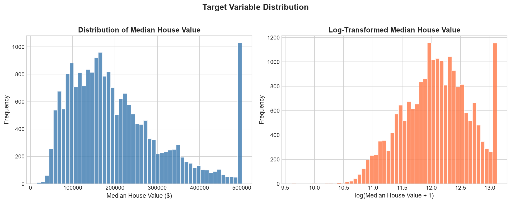
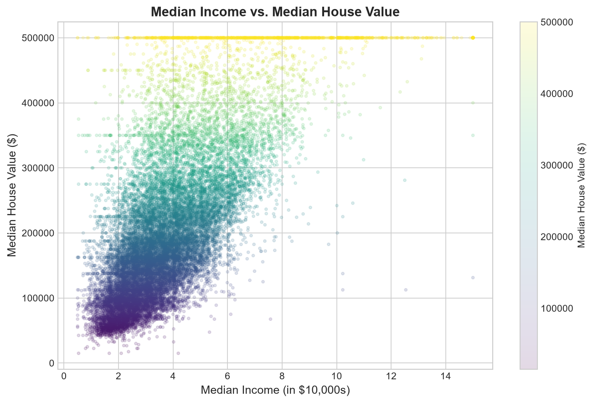
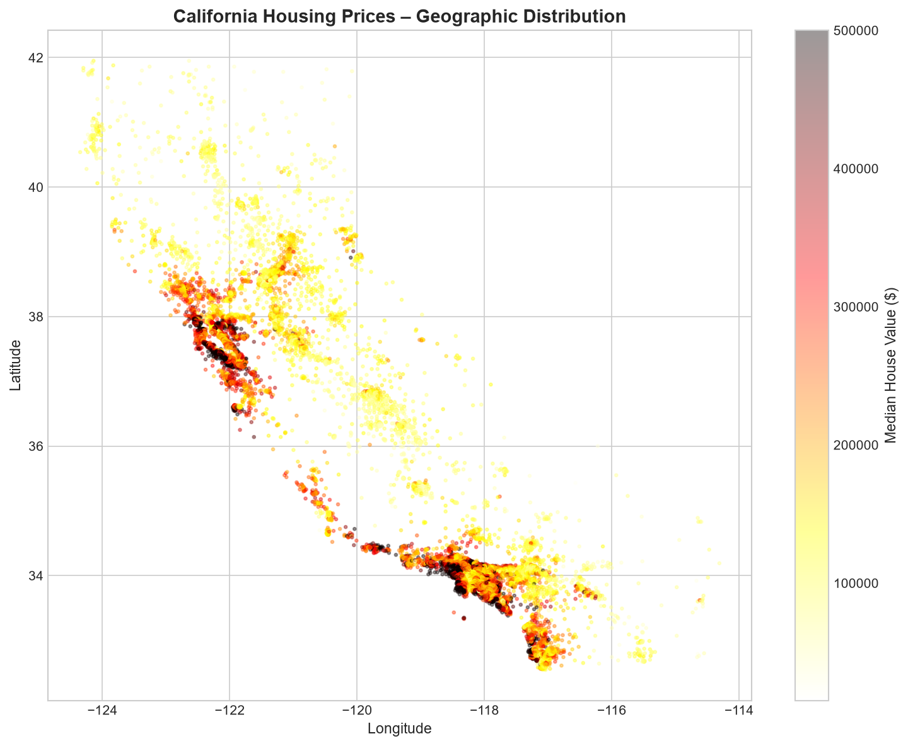
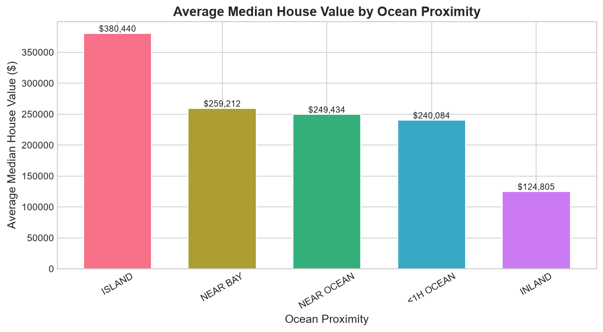
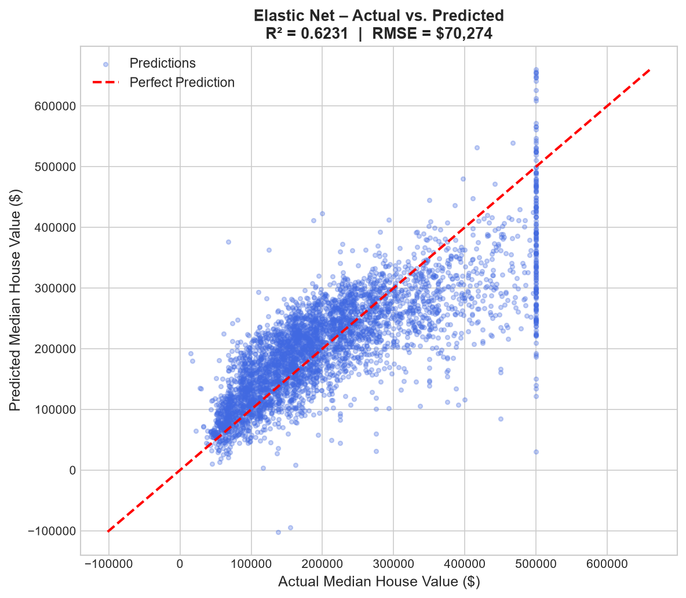
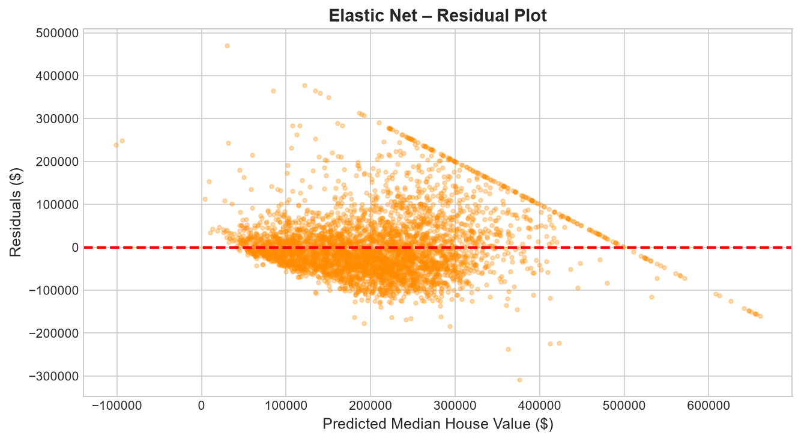
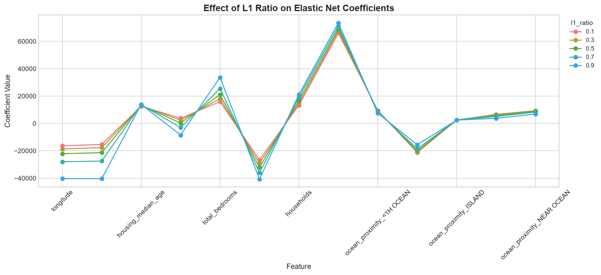

# 🏠 Elastic Net Regression – California Housing Price Prediction

A complete implementation of **Elastic Net Regression** applied to the classic **California Housing Dataset**. This project demonstrates how combining L1 (Lasso) and L2 (Ridge) regularization helps build a robust regression model for predicting median house values.

---

## 📋 Table of Contents

- [Overview](#overview)
- [Dataset](#dataset)
- [What is Elastic Net?](#what-is-elastic-net)
- [Project Workflow](#project-workflow)
- [Exploratory Data Analysis](#exploratory-data-analysis)
- [Model Training & Results](#model-training--results)
- [Key Visualizations](#key-visualizations)
- [Tech Stack](#tech-stack)
- [How to Run](#how-to-run)

---

## 🔍 Overview

This project builds a **regression model** to predict California median house prices using demographic and geographic features. Elastic Net is chosen for its ability to handle multicollinearity and perform automatic feature selection — both critical given the high correlations in housing data.

---

## 📊 Dataset

**File:** `housing.csv`  
**Source:** California Census Data (1990)

| Feature | Description |
|---|---|
| `longitude` | Geographic coordinate (east–west) |
| `latitude` | Geographic coordinate (north–south) |
| `housing_median_age` | Median age of houses in a block |
| `total_rooms` | Total rooms in a block |
| `total_bedrooms` | Total bedrooms in a block (207 missing values → filled with median) |
| `population` | Total population in a block |
| `households` | Number of households in a block |
| `median_income` | Median income (in $10,000s) |
| `ocean_proximity` | Categorical: distance to the ocean |
| `median_house_value` | **Target variable** – Median house value ($) |

**Shape:** 20,640 rows × 10 columns  
**Missing Values:** `total_bedrooms` has 207 nulls → imputed with median  
**Duplicates:** None

---

## 🧠 What is Elastic Net?

Elastic Net is a **regularized linear regression** that combines both **L1 (Lasso)** and **L2 (Ridge)** penalties:

$$\text{Loss} = \text{MSE} + \alpha \left[ \frac{(1 - \rho)}{2} \sum w_i^2 + \rho \sum |w_i| \right]$$

Where:
- **α** (alpha) controls overall regularization strength
- **ρ** (l1_ratio) mixes between Lasso (ρ=1) and Ridge (ρ=0)

| Property | Lasso (L1) | Ridge (L2) | Elastic Net |
|---|---|---|---|
| Feature Selection | ✅ Yes (zeroes out features) | ❌ No | ✅ Yes |
| Handles Multicollinearity | ❌ Poor | ✅ Good | ✅ Good |
| Groups Correlated Features | ❌ Picks one | ✅ Keeps all | ✅ Balanced |

Elastic Net is ideal here because `total_rooms`, `total_bedrooms`, `households`, and `population` are **strongly correlated** (r > 0.85).

---

## 🔄 Project Workflow

```
Raw Data (housing.csv)
        │
        ▼
  Data Exploration (EDA)
  - Shape, types, missing values
  - Correlation matrix
  - Distribution analysis
        │
        ▼
  Preprocessing
  - Impute missing values (median)
  - One-hot encode ocean_proximity
  - StandardScaler normalization
        │
        ▼
  Train / Test Split (80/20)
        │
        ▼
  Elastic Net Model
  - alpha = 0.1, l1_ratio = 0.5
        │
        ▼
  Evaluation
  - R² Score
  - RMSE
```

---

## 📈 Exploratory Data Analysis

### 1. Correlation Heatmap

Reveals strong multicollinearity among housing volume features and the strong positive correlation between `median_income` and `median_house_value` (r = 0.69).



**Key correlations with target (`median_house_value`):**
- `median_income` → **+0.69** (strongest predictor)
- `housing_median_age` → +0.11
- `total_rooms` → +0.13
- `longitude` / `latitude` → weak geographic signal

---

### 2. Target Variable Distribution

The target (`median_house_value`) is **right-skewed** and capped at $500,001 (sensor ceiling). The log-transformed version is more symmetric.



---

### 3. Median Income vs. House Value

A clear **positive linear trend** — median income is the single strongest predictor of house value.



---

### 4. Geographic Distribution

Houses near the **California coast** (especially San Francisco Bay Area and Los Angeles) have significantly higher prices.



---

### 5. Ocean Proximity vs. House Value

Houses marked `ISLAND` and `NEAR BAY` command the highest average prices, while `INLAND` properties are the cheapest.



---

## 🤖 Model Training & Results

**Model:** `ElasticNet(alpha=0.1, l1_ratio=0.5, max_iter=10000)`

| Metric | Value |
|---|---|
| **R² Score** | **0.6231** |
| **RMSE** | **$70,274** |

> The model explains ~62% of the variance in house prices. For a simple linear model without feature engineering, this is a reasonable baseline.

---

## 📉 Key Visualizations

### Actual vs. Predicted

Points close to the red diagonal line indicate accurate predictions. The spread increases at higher price ranges due to the $500k cap in the data.



---

### Residual Plot

Residuals should be randomly distributed around zero. The visible pattern at high predicted values reflects the dataset's price ceiling effect.



---

### Effect of L1 Ratio on Coefficients

Shows how changing `l1_ratio` from 0.1 (more Ridge) to 0.9 (more Lasso) affects which features are retained. Some features get zeroed out as `l1_ratio` increases.



---

## 🛠 Tech Stack

| Tool | Purpose |
|---|---|
| `Python 3.x` | Core language |
| `pandas` | Data loading & manipulation |
| `NumPy` | Numerical operations |
| `scikit-learn` | ElasticNet model, preprocessing, metrics |
| `Matplotlib` | Plotting |
| `Seaborn` | Statistical visualizations |
| `Jupyter Notebook` | Interactive development |

---

## ▶ How to Run

1. **Clone the repository:**
   ```bash
   git clone https://github.com/your-username/AI_ML.git
   cd ML--Models/Elastic-Net-Regression
   ```

2. **Install dependencies:**
   ```bash
   pip install pandas numpy scikit-learn matplotlib seaborn jupyter
   ```

3. **Run the notebook:**
   ```bash
   jupyter notebook Elastic_Net.ipynb
   ```

4. **Or generate plots directly:**
   ```bash
   python generate_plots.py
   ```

---

## 📁 File Structure

```
Elastic-Net-Regression/
├── Elastic_Net.ipynb          # Main Jupyter notebook
├── housing.csv                # California Housing dataset
├── train.csv                  # Training split
├── generate_plots.py          # Script to regenerate all visualizations
├── images/                    # Generated plots
│   ├── correlation_heatmap.png
│   ├── target_distribution.png
│   ├── income_vs_house_value.png
│   ├── geographic_heatmap.png
│   ├── actual_vs_predicted.png
│   ├── residual_plot.png
│   ├── l1_ratio_effect.png
│   └── ocean_proximity_avg_price.png
└── README.md
```

---

> **Note:** Dataset is from the 1990 California Census. Prices are in 1990 USD. The $500,001 cap in `median_house_value` is a known data artifact.
