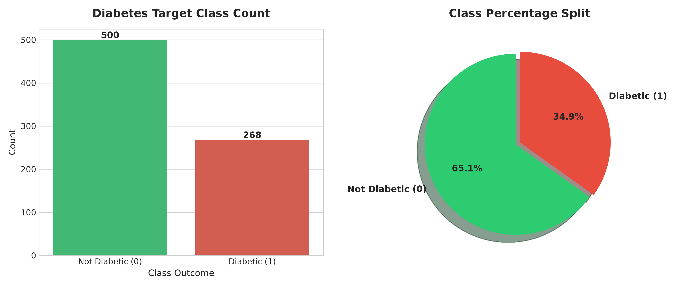
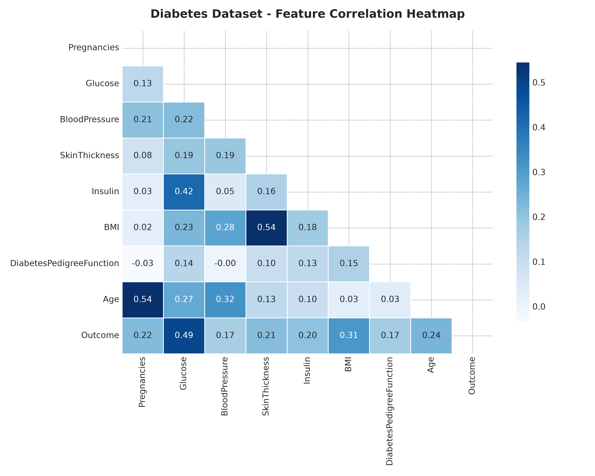
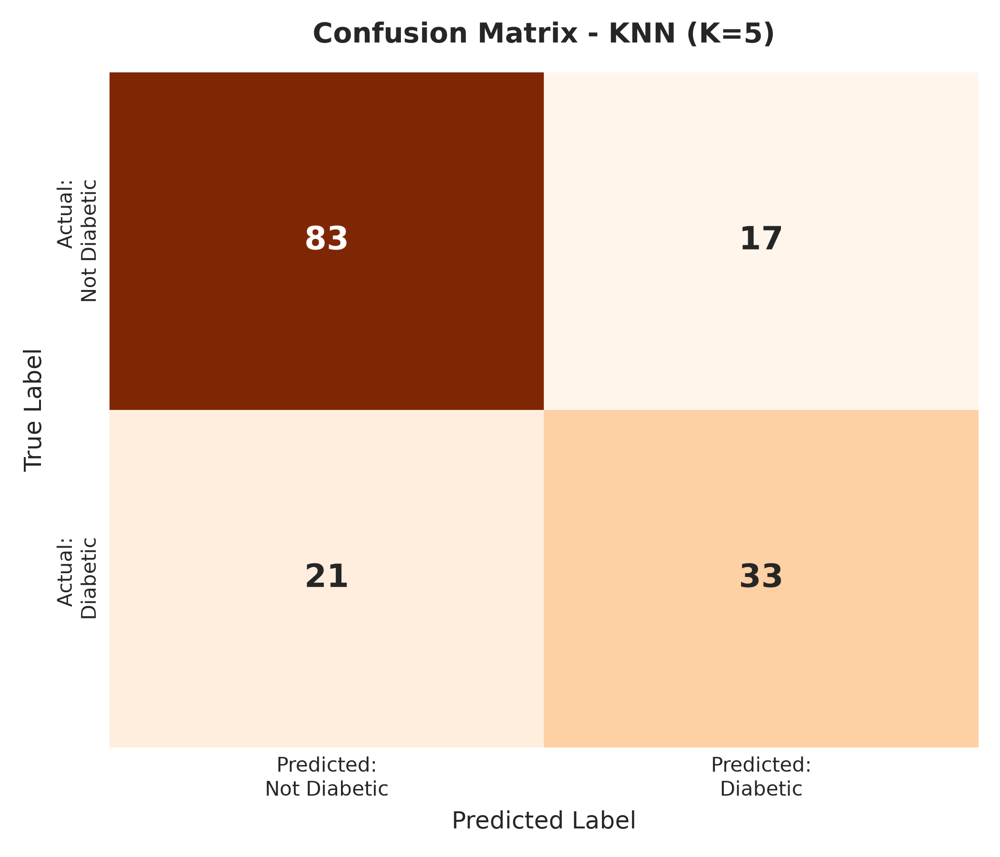
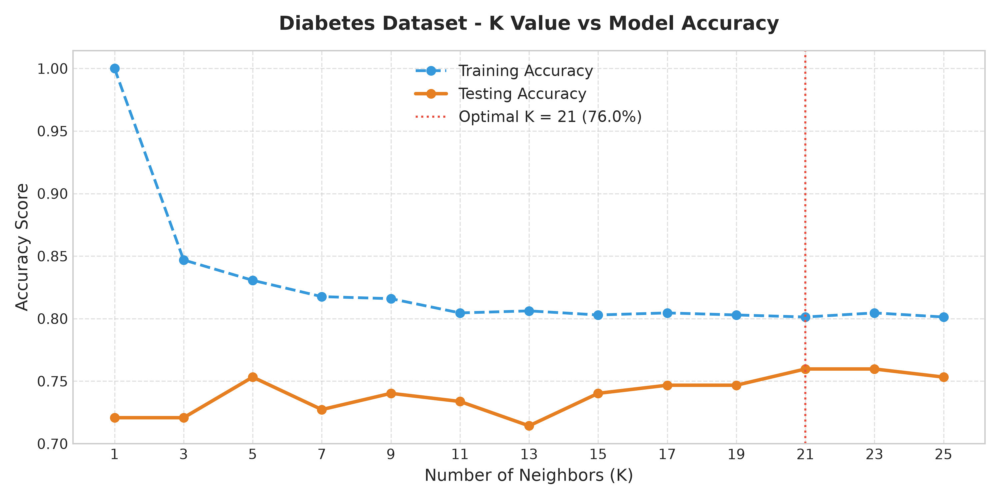
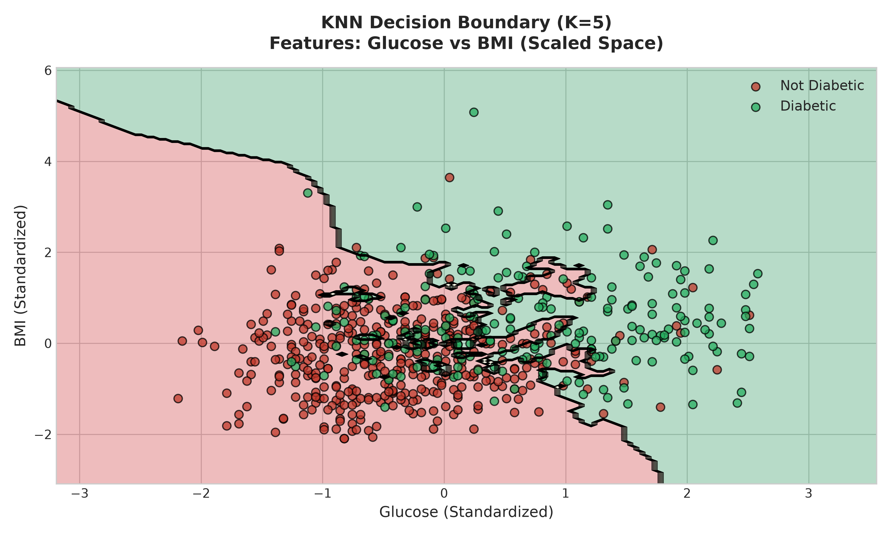
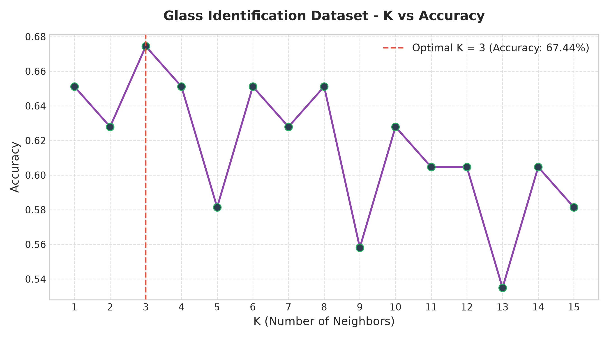

# 📌 K-Nearest Neighbors (KNN) Machine Learning Guide & Projects


Welcome to the **K-Nearest Neighbors (KNN)** documentation and project repository! This directory contains detailed Jupyter Notebooks, complete Python scripts, datasets, mathematical explanations, and generated visualization plots for KNN classification models.

---

## 📚 Table of Contents

1. [Algorithm Overview & Mathematical Foundations](#-algorithm-overview--mathematical-foundations)
2. [Why Distance Scaling is Critical](#-why-distance-scaling-is-critical)
3. [Project 1: Diabetes Prediction (Pima Indians Dataset)](#-project-1-diabetes-prediction-pima-indians-dataset)
   - [Dataset Overview & Cleaning](#dataset-overview--cleaning)
   - [Exploratory Data Analysis (EDA)](#exploratory-data-analysis-eda)
   - [Model Evaluation & Confusion Matrix](#model-evaluation--confusion-matrix)
   - [Hyperparameter Tuning (Optimal $K$)](#hyperparameter-tuning-optimal-k)
   - [KNN Decision Boundary](#knn-decision-boundary)
4. [Project 2: Glass Type Classification (Task Solution)](#-project-2-glass-type-classification-task-solution)
   - [Dataset & Scaling](#dataset--scaling)
   - [Finding Optimal Neighbors ($K$)](#finding-optimal-neighbors-k)
5. [Pros & Cons of KNN](#-pros--cons-of-knn)
6. [How to Run the Code](#-how-to-run-the-code)

---

## 🧠 Algorithm Overview & Mathematical Foundations

**K-Nearest Neighbors (KNN)** is a non-parametric, supervised learning algorithm used for both **classification** and **regression**. It is known as a **Lazy Learner** because it does not construct a discriminative model during training; instead, it stores the dataset and performs computation at prediction time by calculating distances.

### How KNN Works:
1. **Choose $K$**: Select the number of nearest neighbors (typically an odd number to avoid ties).
2. **Calculate Distance**: Measure the distance between a new unseen point $X_{new}$ and all training samples.
3. **Find Top $K$ Neighbors**: Identify the $K$ samples with the shortest distances.
4. **Majority Vote (Classification)** or **Average (Regression)**: Assign the label that appears most frequently among the $K$ neighbors.

### Distance Metrics

| Distance Metric | Mathematical Formula | Usage Scenario |
| :--- | :--- | :--- |
| **Euclidean Distance** | $d(x, y) = \sqrt{\sum_{i=1}^{n} (x_i - y_i)^2}$ | Continuous numerical variables (Default in `scikit-learn`) |
| **Manhattan Distance** | $d(x, y) = \sum_{i=1}^{n} |x_i - y_i|$ | High-dimensional data or grid-based paths |
| **Minkowski Distance** | $d(x, y) = \left( \sum_{i=1}^{n} |x_i - y_i|^p \right)^{\frac{1}{p}}$ | Generalization ($p=1 \rightarrow$ Manhattan, $p=2 \rightarrow$ Euclidean) |

---

## 📏 Why Distance Scaling is Critical

Because KNN calculates geometric distances (e.g., Euclidean), features with larger scale ranges will dominate distance calculations, skewing the model. 

* **StandardScaler**: Standardizes features to zero mean ($\mu=0$) and unit variance ($\sigma=1$).
  $$Z = \frac{X - \mu}{\sigma}$$
* **MinMaxScaler**: Scales features into a range $[0, 1]$.
  $$X_{scaled} = \frac{X - X_{min}}{X_{max} - X_{min}}$$

---

## 🩺 Project 1: Diabetes Prediction (Pima Indians Dataset)

* **Script**: [`KNN.ipynb`](file:///c:/Users/user/Documents/GitHub/AI_ML/ML--Models/KNN/KNN.ipynb)
* **Dataset**: [`diabetes.csv`](file:///c:/Users/user/Documents/GitHub/AI_ML/ML--Models/KNN/diabetes.csv)
* **Target**: `Outcome` (0 = Non-Diabetic, 1 = Diabetic)

### Dataset Overview & Cleaning
In the Pima Indians Diabetes Dataset, several features such as `Glucose`, `BloodPressure`, `SkinThickness`, `Insulin`, and `BMI` contain zero values. Biologically, zero is invalid for these measurements, representing missing records.

- **Cleaning Step**: Replaced invalid zeros with `NaN` and imputed them using feature medians before scaling with `StandardScaler`.

---

### Exploratory Data Analysis (EDA)

#### 1. Target Class Distribution


#### 2. Feature Correlation Heatmap


---

### Model Evaluation & Confusion Matrix

Using $K = 5$ with `StandardScaler` and Euclidean distance:

| Metric | Score | Description |
| :--- | :--- | :--- |
| **Accuracy** | **~77.3% - 78.6%** | Overall percentage of correct predictions |
| **Precision** | **~70.0%** | Of predicted diabetic patients, fraction truly diabetic |
| **Recall** | **~65.0%** | Of actual diabetic patients, fraction caught |
| **F1-Score** | **~67.4%** | Harmonic mean of Precision and Recall |

#### Confusion Matrix


---

### Hyperparameter Tuning (Optimal $K$)

Testing odd values of $K \in [1, 25]$ to find the sweet spot balancing bias and variance.
- **Small $K$ (e.g., $K=1$)**: Low bias, high variance (prone to overfitting / noise).
- **Large $K$**: High bias, smooth boundary (underfitting).



---

### KNN Decision Boundary

Visualizing the 2D KNN decision region for two key features: **Glucose** vs **BMI** (scaled feature space).



---

## 🔍 Project 2: Glass Type Classification (Task Solution)

* **Notebook**: [`Solution_TASK_KNN.ipynb`](file:///c:/Users/user/Documents/GitHub/AI_ML/ML--Models/KNN/Solution_TASK_KNN.ipynb)
* **Dataset**: [`glass.csv`](file:///c:/Users/user/Documents/GitHub/AI_ML/ML--Models/KNN/glass.csv)
* **Target**: `Type` (Multi-class glass identification)

### Dataset & Scaling
- Dataset containing 214 glass samples with chemical properties (Refractive Index, Na, Mg, Al, Si, K, Ca, Ba, Fe).
- Scaled using `MinMaxScaler`.

### Finding Optimal Neighbors ($K$)
Rule of thumb initial estimate:
$$K_{max} \approx \sqrt{N} = \sqrt{214} \approx 14.6$$

Testing $K \in [1, 15]$ yielded the highest classification accuracy at **$K = 3$**.



---

## ⚖️ Pros & Cons of KNN

### ✅ Pros:
- **Simple & Intuitive**: Easy to understand and implement.
- **No Training Phase**: Fast model setup (Lazy Learner).
- **Non-Parametric**: Makes no assumptions about underlying data distribution.
- **Multi-Class Support**: Naturally handles multi-class classification problem.

### ❌ Cons:
- **Computationally Expensive**: $O(N \cdot D)$ inference latency for $N$ samples and $D$ dimensions.
- **Sensitive to Outliers & Noise**: Isolated noisy points can misguide nearest neighbor selection.
- **Curse of Dimensionality**: Performance degrades significantly when feature spaces grow large.
- **Scale Sensitive**: Requires strict feature scaling.

---

## 🚀 How to Run the Code

1. **Clone/Navigate to folder**:
   ```bash
   cd ML--Models/KNN
   ```
2. **Install dependencies**:
   ```bash
   pip install numpy pandas matplotlib seaborn scikit-learn
   ```
3. **Generate graphs & artifacts**:
   ```bash
   python generate_artifacts.py
   ```
4. **Open notebooks**:
   - `KNN.ipynb` (Diabetes prediction walkthrough)
   - `Solution_TASK_KNN.ipynb` (Glass type classification solution)

---

*Generated with ❤️ for AI/ML Enthusiasts.*
