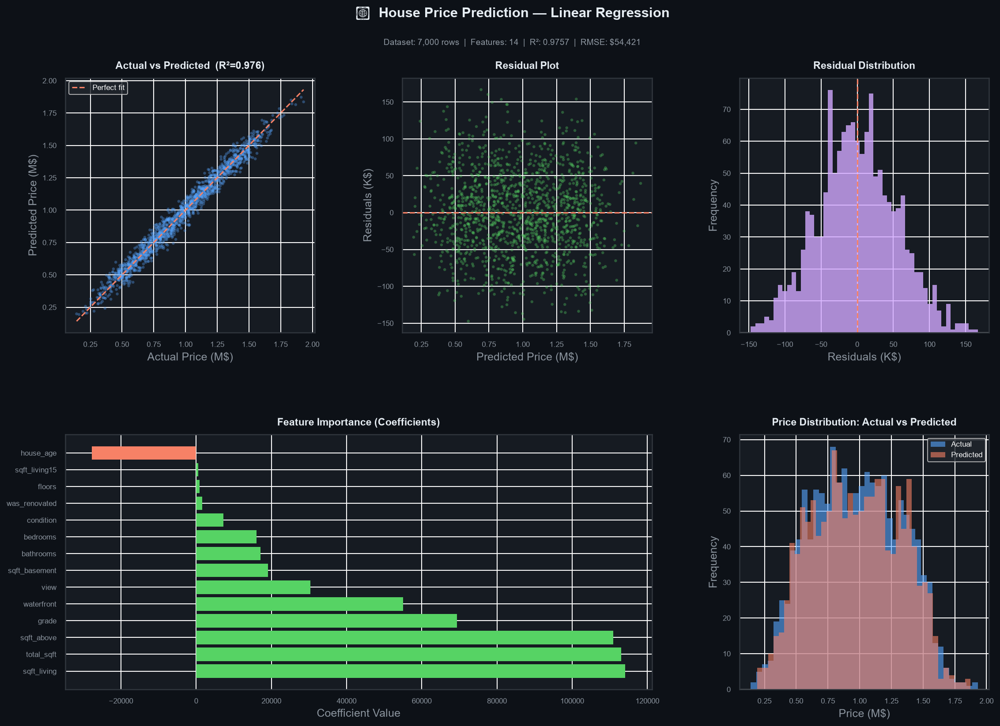

# Linear Regression Projects

<p align="center">
  
  
  
</p>

<p align="center"><b>A hands-on collection of Linear Regression projects, from a simple salary example to real-world student-score and house-price prediction.</b></p>

---

## Projects at a glance

| Project | Dataset | Goal | Main file |
| --- | --- | --- | --- |
| Salary prediction | Small synthetic dataset | Predict salary from years of experience | `linearReg.ipynb` |
| Student performance prediction | `StudentPerformanceFactors.csv` (6,607 rows) | Predict `Exam_Score` from student-related factors | `linearReg.ipynb` |
| House price prediction | `dataset.csv` (7,000 rows) | Predict a home's `price` from property features | `linear_regression.py` / `linear_regression.ipynb` |

## What this repository covers

- Loading and exploring tabular data
- Cleaning missing values and removing outliers
- Encoding categorical features for the student-performance project
- Feature engineering for the house-price project
- Training a `scikit-learn` `LinearRegression` model
- Evaluating predictions with MAE, MSE, RMSE, and R²
- Saving a trained model bundle with Pickle
- Visualizing predictions, residuals, and feature coefficients

## House Price Prediction

The main end-to-end project predicts house prices from property attributes such as living area, bedrooms, bathrooms, quality grade, view, waterfront access, and nearby-home characteristics.

### Pipeline

```text
dataset.csv
    ↓
Clean missing numeric values + remove price outliers (IQR)
    ↓
Create house_age, was_renovated, and total_sqft
    ↓
80/20 train-test split → StandardScaler → LinearRegression
    ↓
Evaluate model → save model.pkl → create prediction.png
```

### Features used

`sqft_living`, `bedrooms`, `bathrooms`, `floors`, `waterfront`, `view`, `condition`, `grade`, `sqft_above`, `sqft_basement`, `sqft_living15`, `house_age`, `was_renovated`, and `total_sqft`.

### Results

The included run achieves approximately **R² = 0.9757**, explaining about **97.57%** of the variation in the house-price test set. The evaluation dashboard also reports MAE, MSE, and RMSE.



## Student Performance Prediction

This notebook project estimates `Exam_Score` using 19 student-related factors, including study time, attendance, previous scores, sleep, tutoring, motivation, access to resources, and family-related variables.

- Missing categorical values are filled with the most frequent value.
- Missing numeric values are filled with the median.
- Categorical features are encoded before model training.
- The model is evaluated on an 80/20 train-test split.

## Quick start

```bash
pip install pandas numpy matplotlib seaborn scikit-learn jupyter
```

Run the complete house-price pipeline:

```bash
python linear_regression.py
```

Or explore the notebooks:

```bash
jupyter notebook linearReg.ipynb
# or
jupyter notebook linear_regression.ipynb
```

## Repository structure

```text
Linear-Regression/
├── dataset.csv                       # House-price dataset
├── StudentPerformanceFactors.csv     # Student-performance dataset
├── linear_regression.py              # House-price ML pipeline
├── linear_regression.ipynb           # House-price notebook
├── linearReg.ipynb                   # Salary and student-performance notebook
├── model.pkl                         # Saved house-price model bundle
├── prediction.png                    # Model evaluation dashboard
└── README.md                         # Project documentation
```

## Linear Regression in brief

Linear Regression learns the relationship between input features and a continuous target value. It is useful when the relationship is reasonably linear and when predictions need to remain easy to interpret.

For reliable results, inspect residuals and consider important assumptions such as linearity, independent observations, roughly constant residual variance, and limited multicollinearity.

## Tools used

`Python` · `pandas` · `NumPy` · `Matplotlib` · `Seaborn` · `scikit-learn` · `Jupyter`
