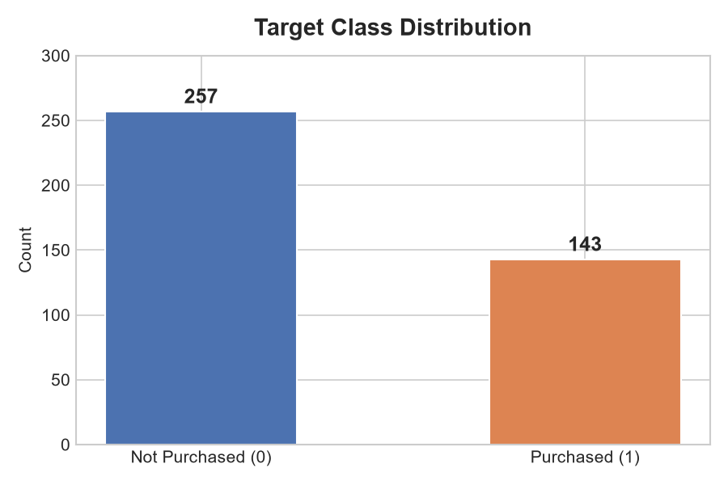
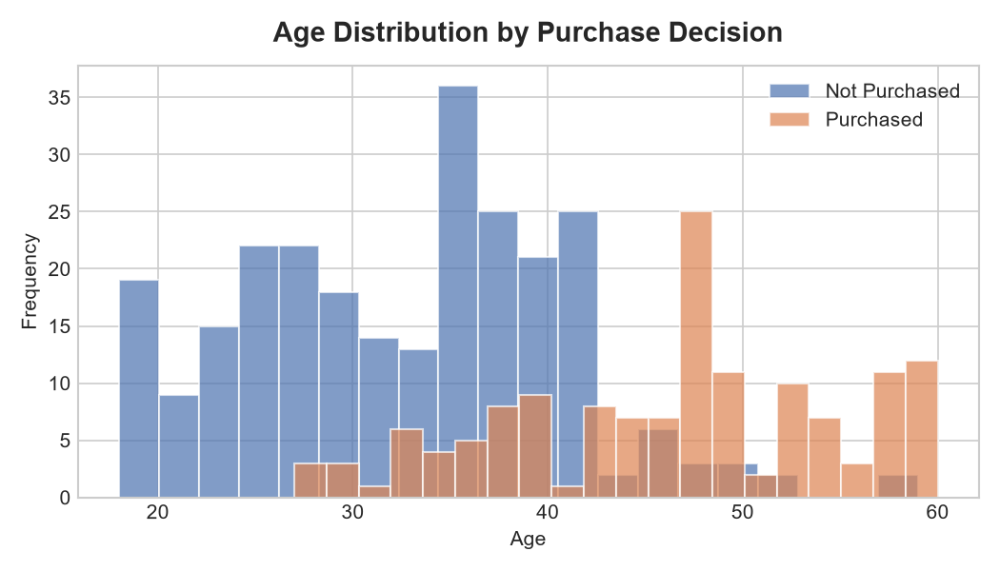
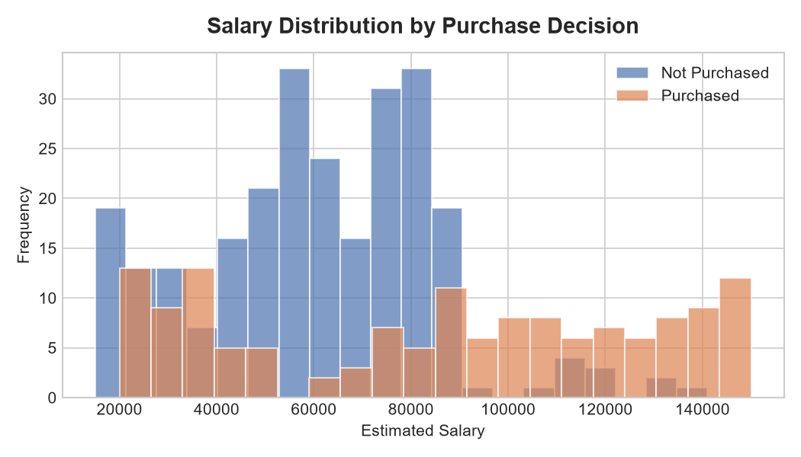
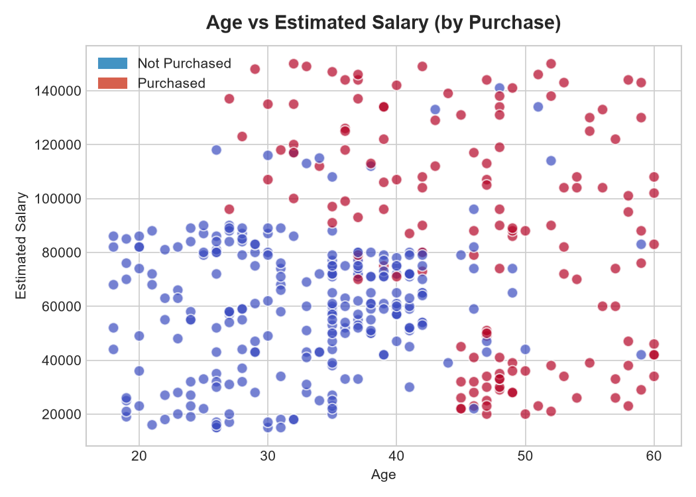
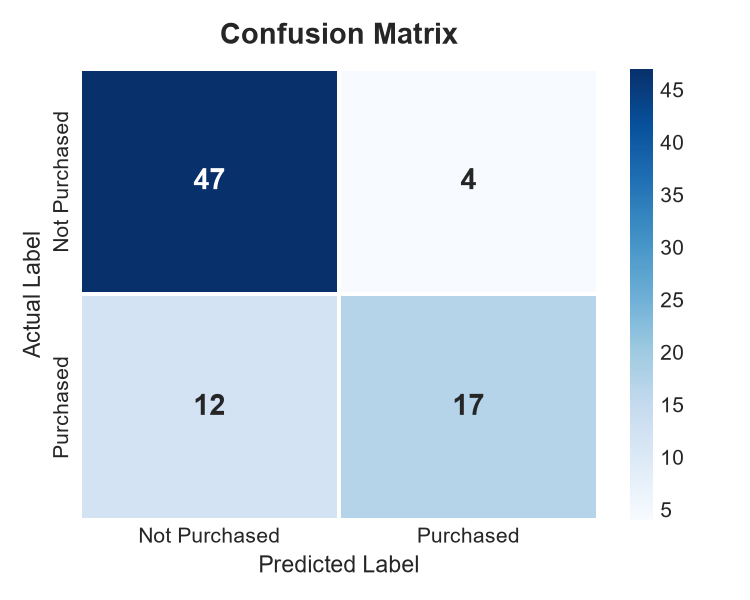
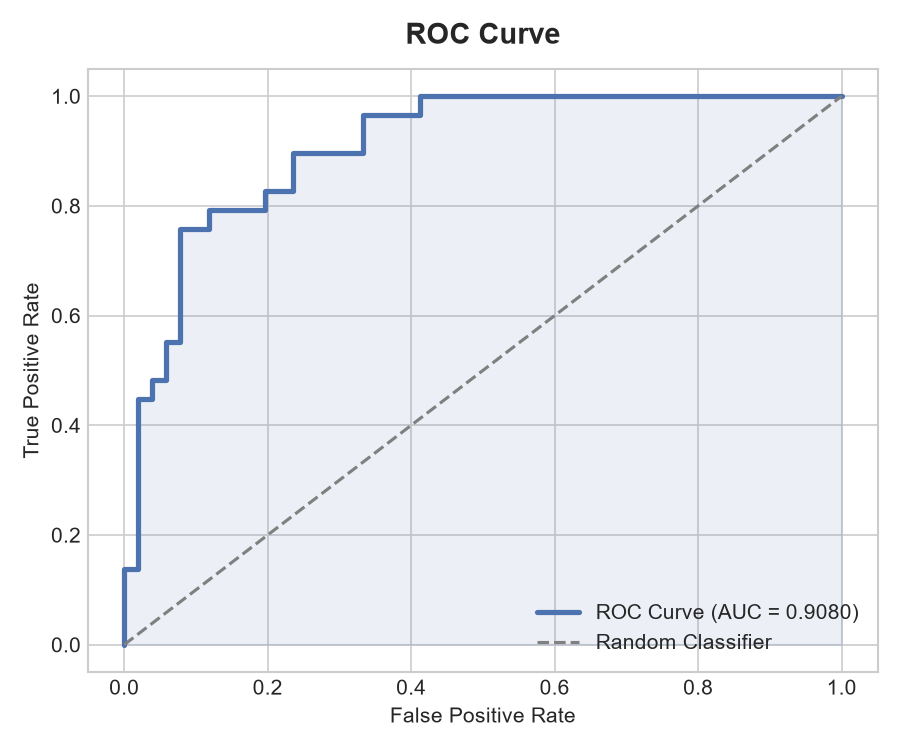
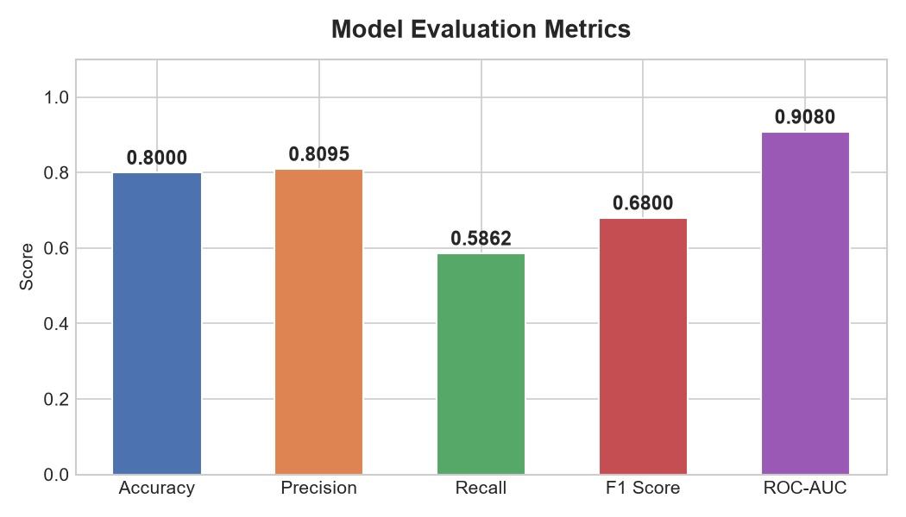
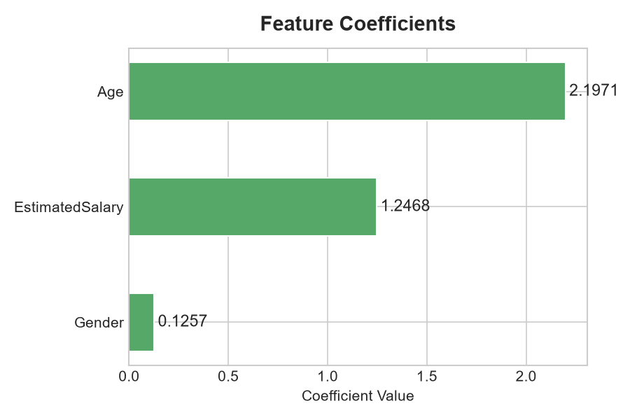

# 📊 Logistic Regression — Social Network Ads

Binary classification problem jisme predict karna hai ke koi user social network ad dekhke product **kharega ya nahi** — Age aur Estimated Salary ke basis par.

---

## 📁 Folder Structure

```
Logistic-Regression/
│
├── logistic.ipynb            # Main Jupyter Notebook (full pipeline)
├── Social_Network_Ads.csv    # Dataset
├── generate_plots.py         # Script to regenerate all graphs
├── images/                   # Generated visualizations
│   ├── class_distribution.png
│   ├── age_distribution.png
│   ├── salary_distribution.png
│   ├── age_vs_salary.png
│   ├── confusion_matrix.png
│   ├── roc_curve.png
│   ├── evaluation_metrics.png
│   └── feature_coefficients.png
└── README.md
```

---

## 📦 Dataset — `Social_Network_Ads.csv`

| Column | Type | Description |
|---|---|---|
| User ID | int | Unique user identifier (dropped during training) |
| Gender | object | Male / Female |
| Age | int | User ki age (18–60) |
| EstimatedSalary | int | Annual salary estimate (15K–150K) |
| Purchased | int | **Target** — 0 = Nahi kharida, 1 = Kharida |

- **Total Rows:** 400  
- **Missing Values:** None ✅  
- **Duplicate Rows:** None ✅  
- **Class Distribution:** 257 Not Purchased (64.25%) | 143 Purchased (35.75%)

---

## ⚙️ ML Pipeline

```
Load CSV → EDA → Feature Engineering → Train/Test Split → 
Feature Scaling → Logistic Regression → Evaluation
```

### Steps Detail

| Step | Description |
|---|---|
| 1. EDA | Shape, dtypes, stats summary, missing/duplicate check |
| 2. Feature Engineering | Gender label encoded (Male=1, Female=0), User ID dropped |
| 3. Features | Gender, Age, EstimatedSalary → predict Purchased |
| 4. Train/Test Split | 80% train (320), 20% test (80), stratified |
| 5. Scaling | StandardScaler — mean≈0, std≈1 |
| 6. Model | LogisticRegression (sklearn, random_state=42) |
| 7. Evaluation | Accuracy, Precision, Recall, F1, ROC-AUC |

---

## 📈 Visualizations

### 1. Target Class Distribution
> Dataset mein kitne users ne purchase kiya aur kitne ne nahi



---

### 2. Age Distribution by Purchase
> Kaunsi age group zyada purchase karti hai



---

### 3. Salary Distribution by Purchase
> High salary wale users purchase karte hain ya nahi



---

### 4. Age vs Estimated Salary (Scatter Plot)
> Age aur Salary ka combination — Red = Purchased, Blue = Not Purchased



---

### 5. Confusion Matrix
> Model ke predictions ka actual values se comparison



```
              Predicted
              Not Buy   Buy
Actual Not Buy  [ 47     4 ]
       Buy      [ 12    17 ]

TN = 47  |  FP = 4
FN = 12  |  TP = 17
```

---

### 6. ROC Curve
> Model ki discrimination ability — AUC = 0.9080



---

### 7. Evaluation Metrics
> Saare metrics ek saath comparison ke liye



---

### 8. Feature Coefficients
> Konsa feature purchase decision par sabse zyada asar karta hai



---

## 📊 Model Results

| Metric | Score |
|---|---|
| **Accuracy** | 80.00% |
| **Precision** | 0.8095 |
| **Recall** | 0.5862 |
| **F1 Score** | 0.6800 |
| **ROC-AUC** | **0.9080** |

### Classification Report

```
               precision    recall  f1-score   support

Not Purchased       0.80      0.92      0.85        51
    Purchased       0.81      0.59      0.68        29

     accuracy                           0.80        80
    macro avg       0.80      0.75      0.77        80
 weighted avg       0.80      0.80      0.79        80
```

---

## 🔢 Feature Coefficients

| Feature | Coefficient | Interpretation |
|---|---|---|
| **Age** | 2.1971 | Sabse zyada impact — umar barhne ke saath purchase probability barhti hai |
| **EstimatedSalary** | 1.2468 | High salary = zyada chances of purchase |
| **Gender** | 0.1257 | Bahut kam impact |

> **Intercept:** -1.1325

---

## 🔮 New Customer Prediction (Example)

```python
Customer  : Gender=Male, Age=30, Salary=87,000
Prediction: ❌ Will NOT Purchase
Confidence: 86.88%
```

---

## 🛠️ Requirements

```bash
pip install numpy pandas scikit-learn matplotlib seaborn
```

---

## ▶️ How to Run

```bash
# Notebook chalane ke liye
jupyter notebook logistic.ipynb

# Sirf graphs regenerate karne ke liye
python generate_plots.py
```

---

## 📌 Key Takeaways

- **Age** sabse powerful predictor hai — older users zyada purchase karte hain
- **Salary** bhi significant impact rakhti hai
- **ROC-AUC = 0.9080** — model bahut achhi discrimination power rakhta hai
- **Recall (0.59)** thodi kam hai — model kuch actual buyers miss karta hai (FN=12)
- Class imbalance (64/36 split) ek factor ho sakta hai

---

*Dataset: Social Network Ads | Model: Logistic Regression (sklearn) | Language: Python 3*
