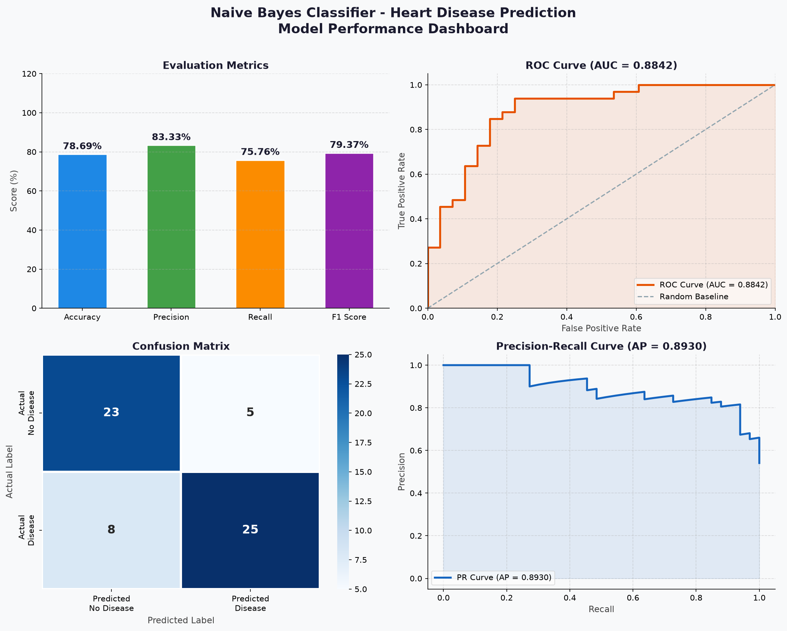
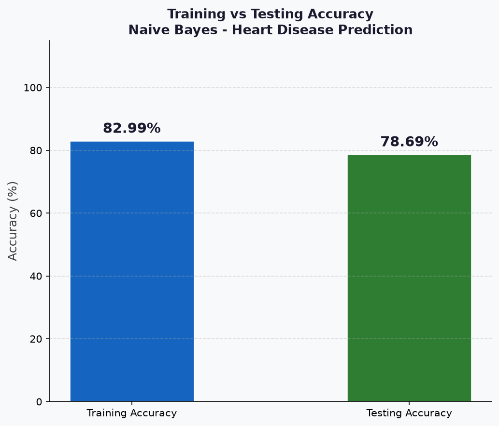
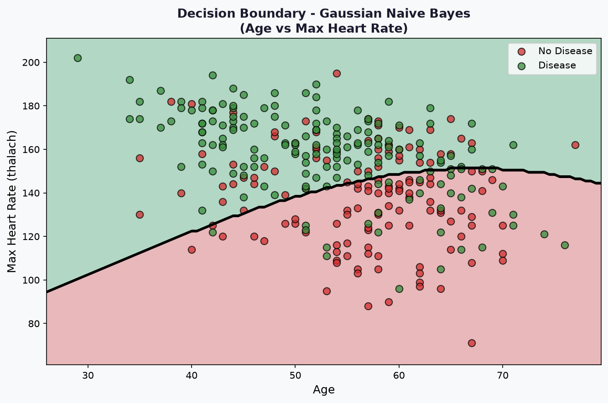
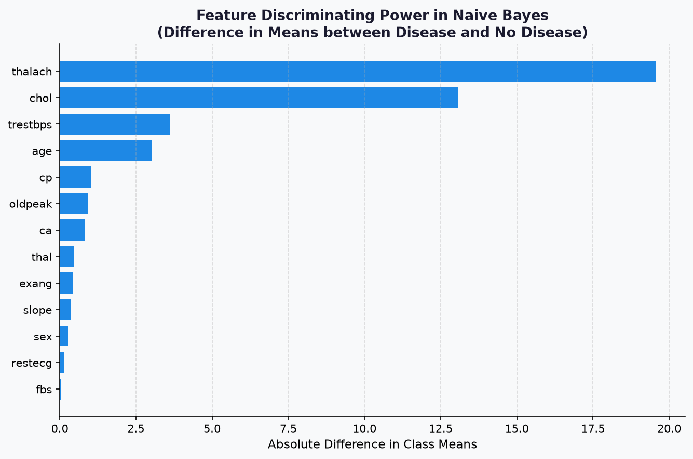

# 🫀 Heart Disease Prediction using Gaussian Naive Bayes

A machine learning project implementing a **Gaussian Naive Bayes Classifier** to predict the presence of heart disease in patients based on 13 medical attributes.

---

## 📁 Repository Structure & Files

| File Name | Type | Description |
| :--- | :--- | :--- |
| [`Heart-dis.csv`](file:///c:/Users/user/Documents/GitHub/AI_ML/ML--Models/Naive-Bayes-Regression/Heart-dis.csv) | Data (CSV) | Raw Heart Disease dataset containing 1,025 patient records and 14 clinical attributes. |
| [`Naive_Bayes.ipynb`](file:///c:/Users/user/Documents/GitHub/AI_ML/ML--Models/Naive-Bayes-Regression/Naive_Bayes.ipynb) | Notebook (IPYNB) | Complete end-to-end Jupyter Notebook with data cleaning, EDA, model training, and performance graphs. |
| [`naive_bayes_dashboard.png`](file:///c:/Users/user/Documents/GitHub/AI_ML/ML--Models/Naive-Bayes-Regression/naive_bayes_dashboard.png) | Visual (PNG) | 4-in-1 performance dashboard (Evaluation Metrics, ROC Curve, Confusion Matrix, Precision-Recall Curve). |
| [`train_vs_test_accuracy.png`](file:///c:/Users/user/Documents/GitHub/AI_ML/ML--Models/Naive-Bayes-Regression/train_vs_test_accuracy.png) | Visual (PNG) | Comparison bar chart showing Training Accuracy vs. Testing Accuracy. |
| [`decision_boundary.png`](file:///c:/Users/user/Documents/GitHub/AI_ML/ML--Models/Naive-Bayes-Regression/decision_boundary.png) | Visual (PNG) | 2D Decision boundary plot illustrating class separation (Age vs Max Heart Rate). |
| [`feature_discriminating_power.png`](file:///c:/Users/user/Documents/GitHub/AI_ML/ML--Models/Naive-Bayes-Regression/feature_discriminating_power.png) | Visual (PNG) | Bar chart displaying absolute difference in mean values between healthy and heart disease classes. |

---

## 📊 Dataset Overview (`Heart-dis.csv`)

The dataset originates from the **Kaggle Heart Disease Dataset** (Cleaveland database collection).

- **Total Records:** 1,025 initial rows (302 unique rows after removing 723 duplicate entries).
- **Features:** 13 numerical feature columns + 1 binary target column.
- **Target Distribution (Cleaned Data):**
  - `0` (No Heart Disease): 138 patients
  - `1` (Heart Disease Present): 164 patients

### Data Attributes Summary

| Column Name | Feature Description | Type / Values |
| :--- | :--- | :--- |
| `age` | Patient's age | Numerical (Years) |
| `sex` | Gender | Binary (1 = Male, 0 = Female) |
| `cp` | Chest Pain Type | Categorical (0: Typical Angina, 1: Atypical Angina, 2: Non-anginal, 3: Asymptomatic) |
| `trestbps` | Resting Blood Pressure | Numerical (mm Hg upon hospital admission) |
| `chol` | Serum Cholestoral | Numerical (mg/dl) |
| `fbs` | Fasting Blood Sugar > 120 mg/dl | Binary (1 = True, 0 = False) |
| `restecg` | Resting Electrocardio Results | Categorical (0: Normal, 1: ST-T wave abnormality, 2: Left ventricular hypertrophy) |
| `thalach` | Maximum Heart Rate Achieved | Numerical |
| `exang` | Exercise Induced Angina | Binary (1 = Yes, 0 = No) |
| `oldpeak` | ST depression induced by exercise | Numerical |
| `slope` | Slope of peak exercise ST segment | Categorical (0: Upsloping, 1: Flat, 2: Downsloping) |
| `ca` | Number of major vessels colored by flourosopy | Numerical (0 to 3) |
| `thal` | Thalassemia | Categorical (1: Normal, 2: Fixed defect, 3: Reversable defect) |
| `target` | Diagnosis Result | Binary Target (**0 = Healthy / No Disease**, **1 = Disease Detected**) |

---

## ⚙️ Model Implementation Workflow (`Naive_Bayes.ipynb`)

The classification pipeline is developed using **Gaussian Naive Bayes** (`sklearn.naive_bayes.GaussianNB`).

### Pipeline Steps:
1. **Data Ingestion & Cleaning:**
   - Checked for null/missing values (0 missing values found).
   - Removed 723 duplicate records to prevent data leakage between train/test sets.
2. **Exploratory Data Analysis (EDA):**
   - Visualized feature distributions and correlation matrix.
3. **Train / Test Split:**
   - 80% Training Set, 20% Testing Set (Stratified Split).
4. **Gaussian Naive Bayes Fitting:**
   - $P(X_i | y) = \frac{1}{\sqrt{2\pi\sigma_y^2}} \exp\left(-\frac{(x_i - \mu_y)^2}{2\sigma_y^2}\right)$
   - Fast, continuous probabilistic classification without feature scaling requirement.
5. **Model Evaluation & Visualization:**
   - Generated evaluation dashboard, ROC AUC, Precision-Recall curves, and Decision Boundary plots.

---

## 📈 Performance & Results

### Quantitative Metrics

| Metric | Score (%) | Description |
| :--- | :---: | :--- |
| **Training Accuracy** | **82.99%** | Accuracy on training dataset (241 samples) |
| **Testing Accuracy** | **78.69%** | Accuracy on unseen test dataset (61 samples) |
| **Precision** | **83.33%** | Positive Predictive Value ($TP / (TP + FP)$) |
| **Recall (Sensitivity)** | **75.76%** | Detection rate ($TP / (TP + FN)$) |
| **F1 Score** | **79.37%** | Harmonic mean of Precision & Recall |

### Confusion Matrix Breakdown

```text
               Predicted: No Disease   Predicted: Disease
Actual: No Disease        23 (TN)                 5 (FP)
Actual: Disease            8 (FN)                25 (TP)
```

- **True Negatives (TN):** 23 correctly identified healthy patients.
- **False Positives (FP):** 5 healthy patients incorrectly classified as diseased.
- **False Negatives (FN):** 8 diseased patients missed by the model.
- **True Positives (TP):** 25 heart disease cases correctly detected.

---

## 🖼️ Visualizations & Graphs

### 1. Model Performance Dashboard (4-in-1)
Contains the **Evaluation Metrics**, **ROC Curve (AUC)**, **Confusion Matrix**, and **Precision-Recall Curve**.



---

### 2. Training vs Testing Accuracy
Compares the model's accuracy between training data and test data to verify generalization without overfitting.



---

### 3. Decision Boundary (Age vs Max Heart Rate)
Illustrates how the Gaussian Naive Bayes decision surface separates healthy patients from heart disease cases using 2 primary features (`age` and `thalach`).



---

### 4. Feature Discriminating Power
Shows the absolute difference in mean feature values ($\mu_1 - \mu_0$) learned by Gaussian Naive Bayes between Disease and No Disease patient groups.



---

## 🚀 How to Run the Code

### 1. Requirements
Ensure you have Python 3.8+ installed along with the following libraries:
```bash
pip install pandas numpy matplotlib seaborn scikit-learn
```

### 2. Execution
You can run the notebook directly in VS Code or Jupyter Lab:
```bash
jupyter notebook Naive_Bayes.ipynb
```

Alternatively, run a python script using the dataset:
```python
import pandas as pd
from sklearn.model_selection import train_test_split
from sklearn.naive_bayes import GaussianNB

# Load clean dataset
df = pd.read_csv('Heart-dis.csv').drop_duplicates()
X = df.drop('target', axis=1)
y = df['target']

X_train, X_test, y_train, y_test = train_test_split(X, y, test_size=0.2, random_state=42, stratify=y)
model = GaussianNB()
model.fit(X_train, y_train)

print(f"Test Accuracy: {model.score(X_test, y_test)*100:.2f}%")
```

---
*Created for Heart Disease Classification using Gaussian Naive Bayes.*
