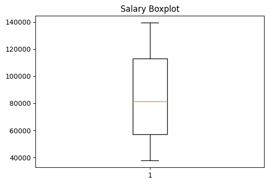
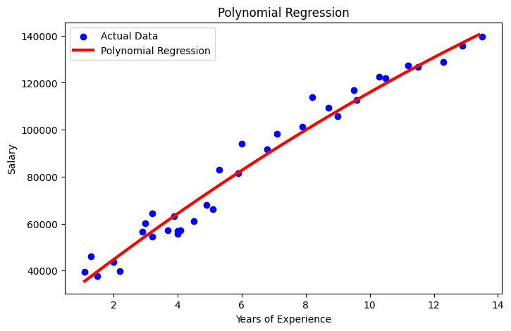

# 📈 Polynomial Regression — Salary Prediction

A machine learning project that uses **Polynomial Regression** to predict employee salaries based on years of experience. Built with Python and scikit-learn, this project walks through a complete ML pipeline: data inspection, EDA, model training, evaluation, and visualization.

---

## 📁 Project Structure

```
Polynomial-Regression/
│
├── polynomial.ipynb     # Main Jupyter Notebook
├── Salary.csv           # Dataset
└── README.md            # Project documentation
```

---

## 📊 Dataset — `Salary.csv`

The dataset contains **35 records** with 2 columns:

| Column            | Type    | Description                        |
|-------------------|---------|------------------------------------|
| `YearsExperience` | float64 | Years of professional experience   |
| `Salary`          | int64   | Annual salary in USD               |

### 📌 Key Statistics

| Stat  | YearsExperience | Salary       |
|-------|-----------------|--------------|
| Count | 35              | 35           |
| Mean  | 6.31            | $83,945      |
| Min   | 1.1             | $37,731      |
| Max   | 13.5            | $139,465     |
| Std   | 3.62            | $32,162      |

> ✅ No missing values. No duplicate rows.

---

## 🔍 Exploratory Data Analysis

### Scatter Plot — Experience vs Salary


A clear **positive trend** is visible — salary increases as years of experience grow. The relationship has a slight curve, making **polynomial regression** a better fit than simple linear regression.

---

### Boxplot — Salary Distribution



The boxplot shows the salary distribution is fairly spread out with **no significant outliers**.

---

## ⚙️ ML Pipeline

### 1. Data Loading & Inspection
- Loaded `Salary.csv` using `pandas`
- Inspected shape, types, statistics, missing values, and duplicates

### 2. Feature Engineering
- **Not required** — the dataset is clean and ready to use

### 3. Encoding & Scaling
- **Not required** — only one numerical feature

### 4. Train/Test Split
- 80% training / 20% test
- `random_state=42`

### 5. Polynomial Feature Transformation
```python
from sklearn.preprocessing import PolynomialFeatures

poly = PolynomialFeatures(degree=2)
X_train_poly = poly.fit_transform(X_train)
X_test_poly  = poly.transform(X_test)
```

### 6. Model Training
```python
from sklearn.linear_model import LinearRegression

model = LinearRegression()
model.fit(X_train_poly, y_train)
```

---

## 📉 Model Evaluation

| Metric     | Value          |
|------------|----------------|
| **MAE**    | 5,879.26       |
| **MSE**    | 42,353,175.94  |
| **RMSE**   | 6,507.93       |
| **R² Score** | **0.9175** ✅  |

> The model explains **~91.75%** of the variance in salary, which is a strong result for a simple two-column dataset.

---

## 📐 Model Coefficients

```
Intercept   : 23,956.64
Coefficients: [0.0, 10663.65, -147.08]
```

The polynomial curve captures both the growth and slight leveling-off of salaries at higher experience levels.

---

## 🔮 Prediction Example

```python
experience = 7  # years
predicted_salary = model.predict(poly.transform([[experience]]))
# Output: ~$91,395.41
```

---

## 📈 Polynomial Regression Curve



The red curve fits the actual data (blue dots) much better than a straight line would — demonstrating why polynomial regression is the right choice here.

---

## 🛠️ Technologies Used

| Tool            | Purpose                        |
|-----------------|--------------------------------|
| Python 3.12     | Programming language           |
| pandas          | Data loading & manipulation    |
| NumPy           | Numerical operations           |
| Matplotlib      | Data visualization             |
| scikit-learn    | ML model & preprocessing       |
| Google Colab    | Notebook environment           |

---

## 🚀 How to Run

1. Clone the repository:
   ```bash
   git clone https://github.com/your-username/AI_ML.git
   cd AI_ML/ML--Models/Polynomial-Regression
   ```

2. Install dependencies:
   ```bash
   pip install pandas numpy matplotlib scikit-learn
   ```

3. Open the notebook:
   ```bash
   jupyter notebook polynomial.ipynb
   ```

   Or open directly in [Google Colab](https://colab.research.google.com/).

---

## 📌 Key Takeaways

- Polynomial regression handles **non-linear relationships** between features and target variables
- Degree 2 was sufficient for this dataset — higher degrees risk **overfitting**
- An R² of **~0.92** on a small dataset of 35 rows is excellent
- The model predicts a salary of **~$91,395** for 7 years of experience

---

## 📄 License

This project is open-source and available under the [MIT License](LICENSE).
