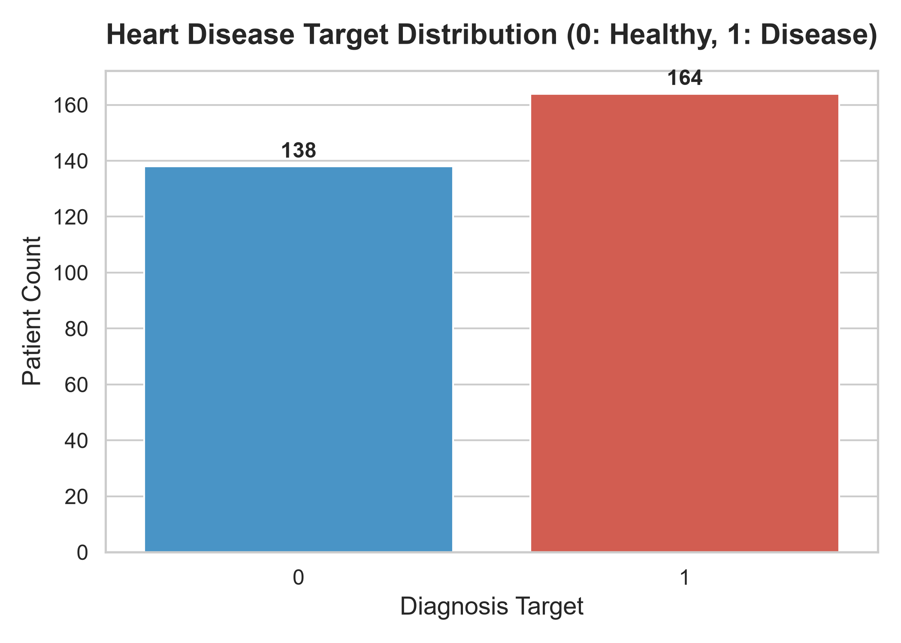
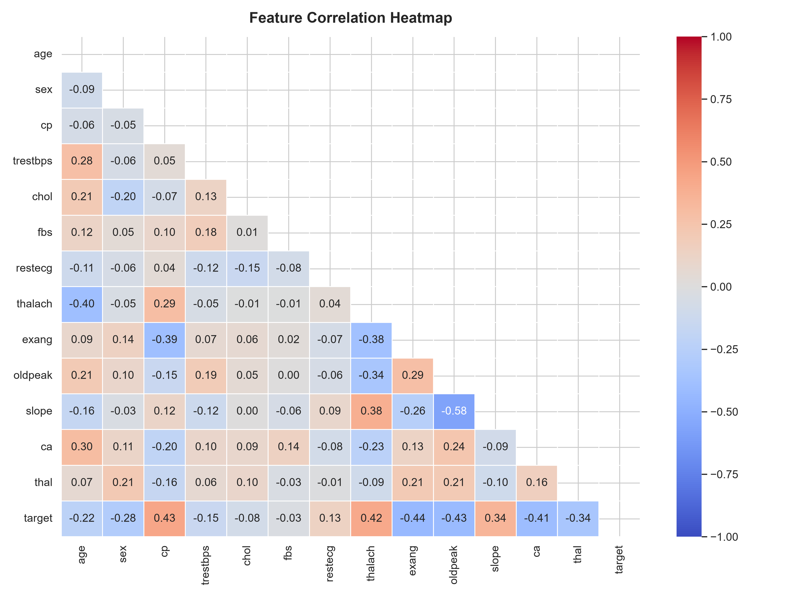
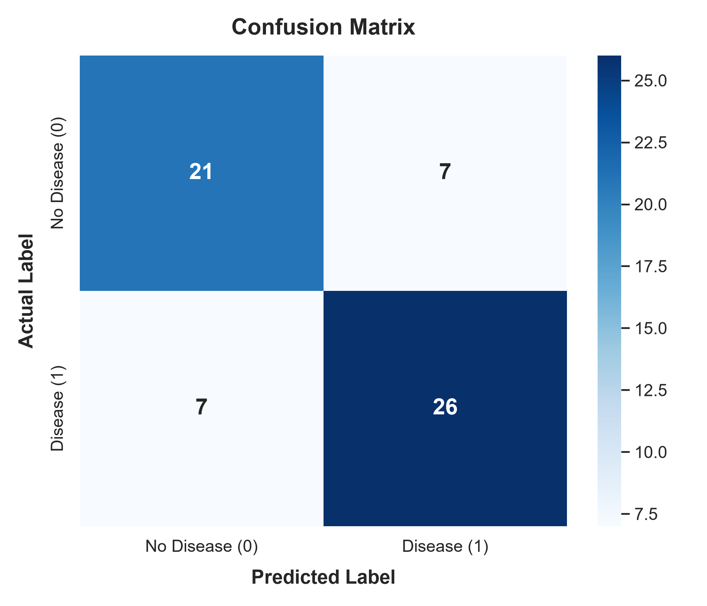
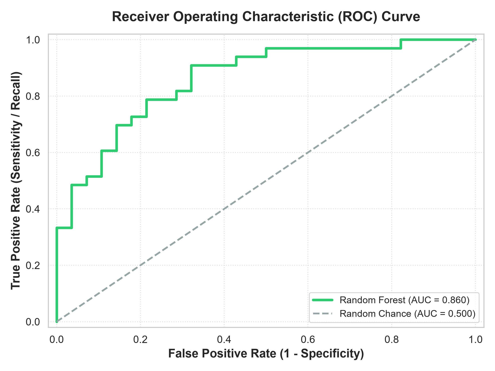
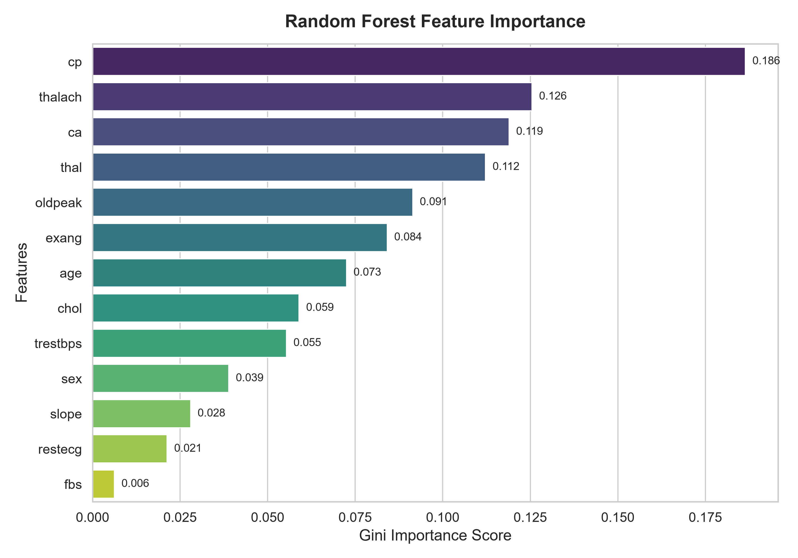

# 🌲 Random Forest Classifier - Heart Disease Prediction

An end-to-end, industry-grade Machine Learning project using **Random Forest Classifier** to predict heart disease presence based on patient clinical parameters. 

This repository includes data preprocessing, duplicate removal (resolving data leakage/overfitting), exploratory data analysis (EDA), hyperparameter tuning, model validation, and feature importance analysis.

---

## 📌 Project Overview

- **Problem Type**: Binary Classification (Heart Disease: `1` = Present, `0` = Healthy)
- **Dataset**: `Heart-dis.csv` (14 features including age, cholesterol, chest pain, max heart rate, etc.)
- **Algorithm**: Random Forest Classifier (`sklearn.ensemble.RandomForestClassifier`)
- **Key Focus**: Rigorous data cleaning, preventing data leakage, hyperparameter tuning, and robust cross-validation.

---

## 📁 Repository Structure

```text
├── Heart-dis.csv                   # Raw dataset (1,025 rows, 14 features)
├── Random_Forest.ipynb             # Complete Jupyter Notebook with code & analysis
├── heart_disease_random_forest.pkl # Saved trained Random Forest model
├── target_distribution.png         # Target distribution plot (Healthy vs Disease)
├── correlation_heatmap.png         # Feature correlation matrix visualization
├── confusion_matrix.png            # Model confusion matrix plot
├── roc_curve.png                   # Receiver Operating Characteristic (ROC) curve
├── feature_importance.png          # Gini feature importance bar plot
└── README.md                       # Comprehensive project documentation
```

---

## 🧹 Data Cleaning & Preprocessing

### ⚠️ Critical Discovery: Duplicate Removal & Data Leakage Prevention
- **Original Dataset Shape**: `(1025, 14)`
- **Duplicate Rows Identified**: `723` rows (~70.5% duplicates)
- **Cleaned Dataset Shape**: `(302, 14)`
- **Missing Values**: `0` (No missing data across all 14 columns)

> **Why Duplicate Removal is Essential**: 
> Retaining duplicate rows between train and test splits causes **data leakage** (identical samples appearing in both sets), artificially producing ~100% accuracy. Removing duplicates ensures a realistic, generalizable evaluation score.

### Target Distribution
After cleaning, the dataset exhibits a balanced binary target distribution:
- **Class 1 (Heart Disease)**: 164 patients (~54.3%)
- **Class 0 (Healthy / No Disease)**: 138 patients (~45.7%)



---

## 📊 Exploratory Data Analysis (EDA)

### Feature Descriptions
| Feature | Description | Range / Values |
| :--- | :--- | :--- |
| `age` | Patient Age in years | 29 - 77 |
| `sex` | Gender | 1 = Male, 0 = Female |
| `cp` | Chest Pain type | 0: Typical Angina, 1: Atypical Angina, 2: Non-anginal, 3: Asymptomatic |
| `trestbps` | Resting Blood Pressure | mm Hg |
| `chol` | Serum Cholesterol | mg/dl |
| `fbs` | Fasting Blood Sugar > 120 mg/dl | 1 = True, 0 = False |
| `restecg` | Resting Electrocardiographic results | 0: Normal, 1: ST-T wave abnormality, 2: Left ventricular hypertrophy |
| `thalach` | Maximum Heart Rate Achieved | bpm |
| `exang` | Exercise Induced Angina | 1 = Yes, 0 = No |
| `oldpeak` | ST depression induced by exercise | Numeric depression score |
| `slope` | Slope of peak exercise ST segment | 0: Upsloping, 1: Flat, 2: Downsloping |
| `ca` | Number of major vessels colored by fluoroscopy | 0 - 4 |
| `thal` | Thalassemia status | 1: Normal, 2: Fixed defect, 3: Reversible defect |
| `target` | Diagnosis of Heart Disease | 0 = No Disease, 1 = Disease |

### Feature Correlation Heatmap
The heatmap below illustrates correlations among clinical features and the target variable.



- **Positive Correlation with Target**: `cp` (Chest Pain), `thalach` (Max Heart Rate), `slope`.
- **Negative Correlation with Target**: `exang` (Exercise Angina), `oldpeak` (ST depression), `ca` (Vessels colored), `sex`, `age`.

---

## ⚙️ Model Architecture & Hyperparameters

A **Random Forest Classifier** ensemble model was trained using `scikit-learn`. Hyperparameters were selected to limit individual tree depth and prevent overfitting on small clinical sample sizes:

```python
RandomForestClassifier(
    n_estimators=200,      # Number of decision trees in forest
    criterion='gini',       # Split quality criterion
    max_depth=8,            # Max depth per tree to restrict overfitting
    min_samples_split=5,    # Min samples required to split an internal node
    min_samples_leaf=2,     # Min samples required at a leaf node
    max_features='sqrt',    # Features considered at each split (sqrt(13) ≈ 3-4)
    bootstrap=True,         # Bootstrap sampling enabled
    random_state=42
)
```

---

## 📈 Performance & Evaluation Metrics

### Accuracy Summary
| Metric | Score |
| :--- | :--- |
| **Training Accuracy** | `97.93%` |
| **Testing Accuracy** | `77.05%` |
| **5-Fold Cross-Validation (Mean)** | `83.10%` |
| **ROC-AUC Score** | `0.852` |

### 5-Fold Cross-Validation Scores
- **Fold 1**: 86.88%
- **Fold 2**: 83.61%
- **Fold 3**: 90.00%
- **Fold 4**: 78.33%
- **Fold 5**: 76.67%
- **Average CV Score**: **83.10%**

---

### Classification Report
```text
               precision    recall  f1-score   support

  No Disease       0.75      0.75      0.75        28
     Disease       0.79      0.79      0.79        33

    accuracy                           0.77        61
   macro avg       0.77      0.77      0.77        61
weighted avg       0.77      0.77      0.77        61
```

---

### Confusion Matrix
The confusion matrix demonstrates model performance on 61 unseen test samples:



- **True Negatives (Healthy predicted Healthy)**: 21
- **False Positives (Healthy predicted Disease)**: 7
- **False Negatives (Disease predicted Healthy)**: 7
- **True Positives (Disease predicted Disease)**: 26

---

### Receiver Operating Characteristic (ROC) Curve
The ROC curve demonstrates strong discrimination capability across decision thresholds with an **AUC score of ~0.85**.



---

## 🔍 Feature Importance Analysis

Random Forest calculates feature importance using the **Gini impurity reduction** contributed by each clinical feature across all 200 trees:



### Key Predictors of Heart Disease:
1. **`cp` (Chest Pain Type)**: Highest predictor (~13.9% importance)
2. **`thalach` (Max Heart Rate)**: Strong indicator of cardiovascular fitness (~12.6%)
3. **`ca` (Major Vessels Fluoroscopy)**: Anatomic blockage indicator (~11.6%)
4. **`oldpeak` (ST Depression)**: Exercise-induced ECG abnormality (~11.3%)
5. **`thal` (Thalassemia Status)**: Blood disorder status (~10.9%)

---

## 💻 Python Implementation

```python
import joblib
import pandas as pd
import numpy as np
from sklearn.ensemble import RandomForestClassifier
from sklearn.model_selection import train_test_split, cross_val_score
from sklearn.metrics import classification_report, confusion_matrix, roc_auc_score

# 1. Load Dataset
df = pd.read_csv("Heart-dis.csv")

# 2. Preprocess: Remove duplicate entries
df_clean = df.drop_duplicates().reset_index(drop=True)

# 3. Train/Test Split with Stratification
X = df_clean.drop("target", axis=1)
y = df_clean["target"]

X_train, X_test, y_train, y_test = train_test_split(
    X, y, test_size=0.2, random_state=42, stratify=y
)

# 4. Train Random Forest Model
rf_model = RandomForestClassifier(
    n_estimators=200,
    max_depth=8,
    min_samples_split=5,
    min_samples_leaf=2,
    max_features="sqrt",
    bootstrap=True,
    random_state=42
)
rf_model.fit(X_train, y_train)

# 5. Evaluate Model
y_pred = rf_model.predict(X_test)
y_prob = rf_model.predict_proba(X_test)[:, 1]

print(f"Training Accuracy : {rf_model.score(X_train, y_train):.4f}")
print(f"Testing Accuracy  : {rf_model.score(X_test, y_test):.4f}")
print(f"ROC-AUC Score     : {roc_auc_score(y_test, y_prob):.4f}")

# 6. Save Model
joblib.dump(rf_model, "heart_disease_random_forest.pkl")
```

---

## 💾 Model Serialization & Inference

The trained Random Forest classifier is saved using `joblib` as `heart_disease_random_forest.pkl`.

### Predict on New Patient Sample
```python
import joblib
import pandas as pd

# Load saved model
model = joblib.load("heart_disease_random_forest.pkl")

# Patient features: [age, sex, cp, trestbps, chol, fbs, restecg, thalach, exang, oldpeak, slope, ca, thal]
new_patient = pd.DataFrame([{
    'age': 57,
    'sex': 1,
    'cp': 0,
    'trestbps': 140,
    'chol': 241,
    'fbs': 0,
    'restecg': 1,
    'thalach': 123,
    'exang': 1,
    'oldpeak': 0.2,
    'slope': 1,
    'ca': 0,
    'thal': 3
}])

prediction = model.predict(new_patient)
probability = model.predict_proba(new_patient)

print("Prediction:", "Heart Disease" if prediction[0] == 1 else "Healthy")
print(f"Confidence : {probability[0][prediction[0]] * 100:.2f}%")
```

---

## 💡 Viva / Technical Interview QA

**Q1: Why did raw accuracy drop from 100% to ~77%-83% after preprocessing?**
> *Answer*: The raw dataset contained 723 duplicate rows out of 1,025. Leaving duplicates causes data leakage across train and test sets, inflating test performance. Removing duplicate rows reflects authentic, un-leaked evaluation.

**Q2: How does Random Forest reduce variance compared to a single Decision Tree?**
> *Answer*: Random Forest builds multiple decision trees via bootstrap aggregation (bagging) and feature sub-sampling (`max_features="sqrt"`). By averaging tree predictions, random uncorrelated errors cancel out, reducing model variance without increasing bias.

**Q3: What is Gini Feature Importance?**
> *Answer*: It measures the total mean decrease in Gini impurity brought by splits on a specific feature across all trees in the forest, weighted by the number of samples reaching those nodes.

---

## 📜 License
This project is for educational, research, and technical interview demonstration purposes.
