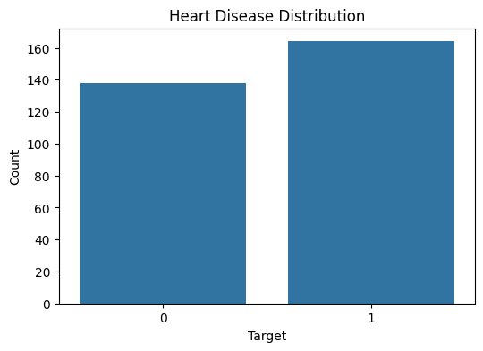
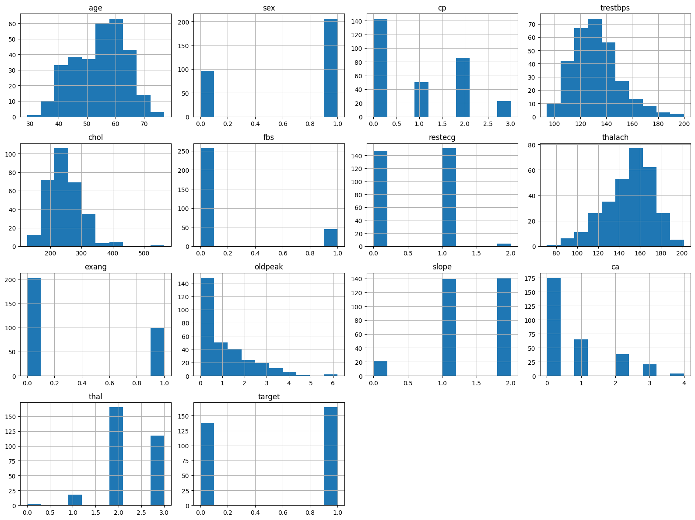
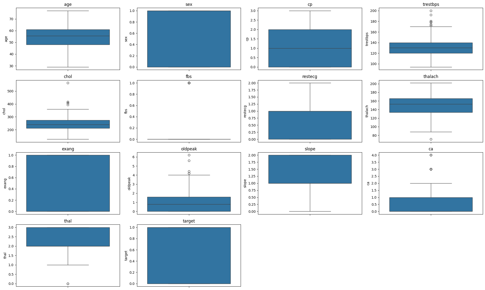
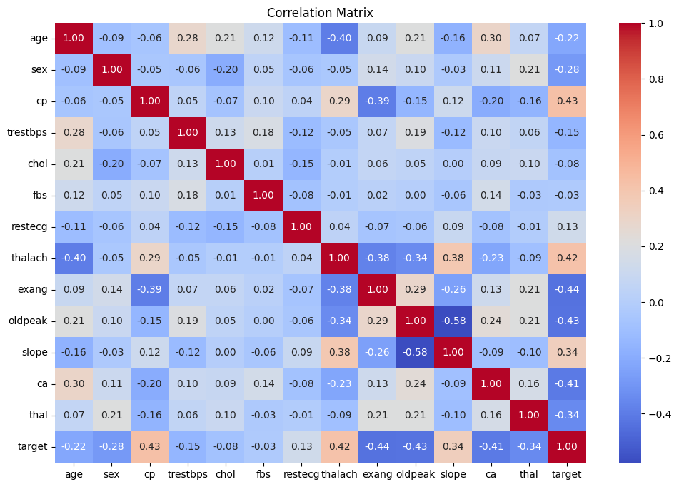
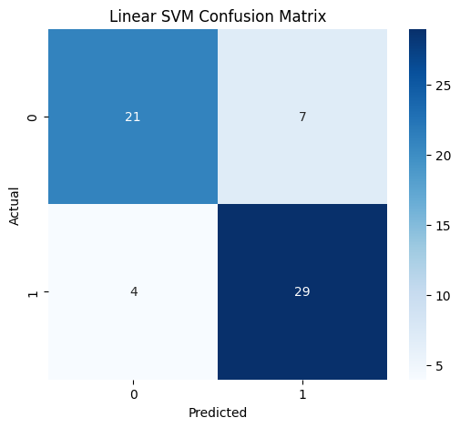
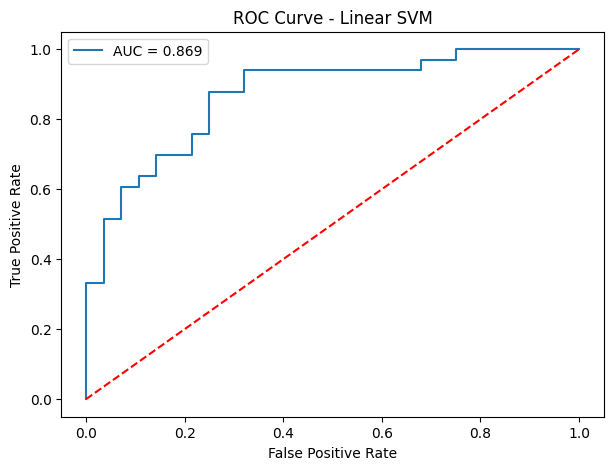
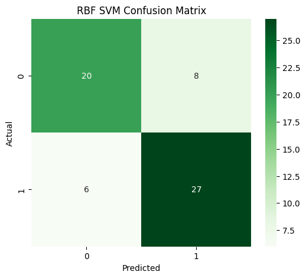
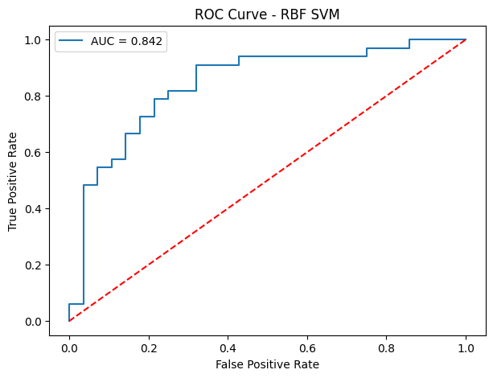
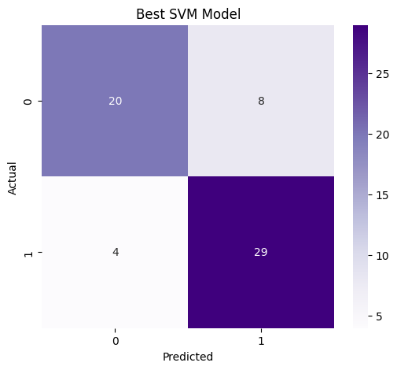

# 🫀 Heart Disease Prediction using Support Vector Machines (SVM)

[](https://www.python.org/)
[](https://scikit-learn.org/)
[](https://pandas.pydata.org/)
[]()

An end-to-end Machine Learning project demonstrating classification of Heart Disease using **Support Vector Machines (SVM)**. The project covers data cleaning, exploratory data analysis (EDA), feature scaling, model training across multiple kernels (Linear, RBF), hyperparameter optimization using **GridSearchCV**, model evaluation, and artifact serialization (`.pkl`) for production deployment.

---

## 📌 Table of Contents
- [Project Overview](#-project-overview)
- [Dataset Architecture & Feature Dictionary](#-dataset-architecture--feature-dictionary)
- [Exploratory Data Analysis (EDA)](#-exploratory-data-analysis-eda)
- [Machine Learning Workflow](#-machine-learning-workflow)
- [Model Evaluation & Comparison](#-model-evaluation--comparison)
- [GridSearchCV Hyperparameter Optimization](#-gridsearchcv-hyperparameter-optimization)
- [Model Persistence & Inference](#-model-persistence--inference)
- [Project Structure](#-project-structure)
- [How to Run](#-how-to-run)

---

## 🎯 Project Overview

Heart disease is one of the leading causes of mortality worldwide. Early diagnostic detection allows healthcare providers to implement preventative care strategies. 

This repository leverages clinical parameters from patient records to train high-performing **Support Vector Machine (SVM)** classifiers. 

### Highlights:
- **Data Cleaning**: Handled duplicate entries (reduced from 1,025 to 302 unique patient instances) ensuring zero missing values.
- **Exploratory Visualizations**: Statistical distribution plots, correlation matrices, boxplots, and scatter relationships.
- **Preprocessing**: Feature standardisation via `StandardScaler` to ensure optimal distance computation in SVM hyperplane decision boundaries.
- **Model Experimentation**: Evaluated Linear SVM, Default RBF Kernel SVM, and Hyperparameter-Tuned RBF SVM.
- **Model Evaluation Metrics**: Accuracy, Precision, Recall, F1-Score, Confusion Matrices, and ROC-AUC curves.
- **Production Readiness**: Serialized tuned SVM model and standard scaler as `.pkl` files using `joblib`.

---

## 📊 Dataset Architecture & Feature Dictionary

The dataset `Heart-dis.csv` contains 302 clean patient observations with **13 clinical input features** and **1 binary target variable**.

| Feature Name | Type | Description | Values / Range |
| :--- | :--- | :--- | :--- |
| `age` | Integer | Age of patient in years | 29 – 77 |
| `sex` | Binary | Gender of the patient | `1` = Male, `0` = Female |
| `cp` | Categorical | Chest Pain Type | `0`: Typical Angina<br>`1`: Atypical Angina<br>`2`: Non-anginal Pain<br>`3`: Asymptomatic |
| `trestbps` | Integer | Resting Blood Pressure (mm Hg upon admission) | 94 – 200 mm Hg |
| `chol` | Integer | Serum Cholesterol level | 126 – 564 mg/dl |
| `fbs` | Binary | Fasting Blood Sugar > 120 mg/dl | `1` = True, `0` = False |
| `restecg` | Categorical | Resting Electrocardiographic Results | `0`: Normal<br>`1`: ST-T wave abnormality<br>`2`: Left ventricular hypertrophy |
| `thalach` | Integer | Maximum Heart Rate Achieved | 71 – 202 bpm |
| `exang` | Binary | Exercise Induced Angina | `1` = Yes, `0` = No |
| `oldpeak` | Float | ST Depression induced by exercise relative to rest | 0.0 – 6.2 |
| `slope` | Categorical | Slope of Peak Exercise ST Segment | `0`: Upsloping<br>`1`: Flat<br>`2`: Downsloping |
| `ca` | Integer | Number of Major Vessels colored by Fluoroscopy | 0 – 4 |
| `thal` | Categorical | Thalassemia Type | `0`: Normal<br>`1`: Fixed Defect<br>`2`: Reversible Defect<br>`3`: Unspecified |
| **`target`** | **Binary Target** | **Heart Disease Diagnosis** | **`1` = Disease Detected**<br>**`0` = No Disease Detected** |

---

## 🔍 Exploratory Data Analysis (EDA)

### 1. Target Class Distribution
The dataset exhibits a healthy balance between heart disease positive and negative cases.
- **Heart Disease (1)**: 164 patients (54.3%)
- **No Heart Disease (0)**: 138 patients (45.7%)



---

### 2. Feature Distribution Histograms
Individual numerical feature distributions highlight skewness in parameters like `chol`, `fbs`, `oldpeak`, and `ca`.



---

### 3. Outlier Detection via Boxplots
Boxplots are utilized across all continuous features to identify extreme outliers prior to SVM scaling.



---

### 4. Bivariate Analysis: Age vs. Max Heart Rate (`thalach`)
Visualization comparing maximum heart rate against patient age, categorized by disease outcome. Patients with heart disease generally demonstrate higher maximum heart rates even at older ages.



---

### 5. Correlation Heatmap
Spearman/Pearson correlation matrix detailing linear relationships between input variables and the diagnostic target. `cp`, `thalach`, and `slope` show positive correlation with the target, while `exang`, `oldpeak`, and `ca` display negative correlation.


---

## 🛠️ Machine Learning Workflow

```
Raw Data (Heart-dis.csv) 
   │
   ├──> Deduplication (1025 ➔ 302 unique rows)
   │
   ├──> Feature Matrix X (13 features) & Target y
   │
   ├──> Train/Test Split (80% Train, 20% Test, Stratified)
   │
   ├──> StandardScaler Fitting & Transformation
   │
   ├──> Model Training & Comparison (Linear SVM vs RBF SVM)
   │
   ├──> Hyperparameter Optimization (GridSearchCV)
   │
   └──> Model Serialization (svm_heart_model.pkl & scaler.pkl)
```

---

## 📈 Model Evaluation & Comparison

Models were trained on **241 training samples** and evaluated on **61 unseen test samples**.

### 📊 Performance Summary

| Model | Accuracy | Precision | Recall | F1-Score | ROC-AUC |
| :--- | :---: | :---: | :---: | :---: | :---: |
| 🥇 **Linear SVM** | **81.97%** | **80.56%** | **87.88%** | **84.06%** | **0.8690** |
| 🥈 **Best GridSearch Model (Tuned RBF)** | **80.33%** | **78.38%** | **87.88%** | **82.86%** | **0.8339 (CV)** |
| 🥉 **Default RBF SVM** | **77.05%** | **77.14%** | **81.82%** | **79.41%** | **0.8420** |

---

### 1. Linear SVM Evaluation
- **Accuracy**: 81.97%
- **ROC-AUC Score**: 0.8690

| Confusion Matrix | ROC Curve |
| :---: | :---: |
|  |  |

---

### 2. Default RBF SVM Evaluation
- **Accuracy**: 77.05%
- **ROC-AUC Score**: 0.8420

| Confusion Matrix | ROC Curve |
| :---: | :---: |
|  |  |

---

### 3. GridSearch Optimised Model Evaluation
- **Test Accuracy**: 80.33%
- **Cross-Validation Accuracy**: 83.39%



---

### 4. Overall Model Comparison Chart


---

## ⚙️ GridSearchCV Hyperparameter Optimization

To extract optimal classification performance, `GridSearchCV` with 5-fold cross-validation was conducted over the following hyperparameter grid:

```python
param_grid = {
    'C': [0.1, 1, 10, 100],
    'gamma': [1, 0.1, 0.01, 0.001],
    'kernel': ['rbf', 'linear', 'poly', 'sigmoid']
}
```

### Optimal Hyperparameters Found:
- **Kernel**: `'rbf'`
- **`C` (Regularization parameter)**: `100`
- **`gamma` (Kernel coefficient)**: `0.001`
- **Best Cross-Validation Score**: **83.39%**

---

## 💾 Model Persistence & Inference

The trained model and scaling transformer are saved locally for integration into downstream APIs or applications.

Saved Artifacts:
- `svm_heart_model.pkl` - Serialized SVM model object.
- `scaler.pkl` - Serialized `StandardScaler` fitted on training data.

### Sample Inference Code

```python
import joblib

# 1. Load serialized artifacts
model = joblib.load("svm_heart_model.pkl")
scaler = joblib.load("scaler.pkl")

# 2. Define single patient sample feature vector (13 features)
# [age, sex, cp, trestbps, chol, fbs, restecg, thalach, exang, oldpeak, slope, ca, thal]
new_patient = [[63, 1, 3, 145, 233, 1, 0, 150, 0, 2.3, 0, 0, 1]]

# 3. Scale features using the loaded scaler
scaled_patient = scaler.transform(new_patient)

# 4. Predict diagnosis
prediction = model.predict(scaled_patient)

if prediction[0] == 1:
    print("⚠️ Result: Heart Disease Detected")
else:
    print("✅ Result: No Heart Disease Detected")
```

---

## 📂 Project Structure

```
SVM/
├── Heart-dis.csv                             # Raw Clinical Heart Disease Dataset
├── SVM.ipynb                                 # Complete Execution Notebook (EDA, Models, Tuning)
├── README.md                                 # Project Documentation (This file)
├── svm_heart_model.pkl                       # Saved Trained SVM Model
├── scaler.pkl                                # Saved StandardScaler Object
└── images/                                   # Extracted EDA and Evaluation Graphs
    ├── 01_target_distribution.png
    ├── 02_feature_histograms.png
    ├── 03_feature_boxplots.png
    ├── 04_age_vs_thalach.png
    ├── 05_correlation_heatmap.png
    ├── 06_linear_svm_confusion_matrix.png
    ├── 07_linear_svm_roc_curve.png
    ├── 08_rbf_svm_confusion_matrix.png
    ├── 09_rbf_svm_roc_curve.png
    ├── 10_best_gridsearch_confusion_matrix.png
    └── 11_model_comparison_bar_chart.png
```

---

## 🚀 How to Run

### 1. Clone & Navigate to Repository
```bash
git clone https://github.com/Zohaibfaiz/AI_ML.git
cd AI_ML/ML--Models/SVM
```

### 2. Install Required Dependencies
```bash
pip install pandas numpy scikit-learn matplotlib seaborn joblib
```

### 3. Run Notebook or Inference Script
Open `SVM.ipynb` using Jupyter Notebook or Jupyter Lab:
```bash
jupyter notebook SVM.ipynb
```

---

## 📜 License & Acknowledgments
This project is part of the **AI/ML Machine Learning Models Collection** by Zohaib Faiz. Free to use for educational and research purposes.
