# 🤖 AI & Machine Learning Master Repository (`AI_ML`)

> **An End-to-End Master Repository for Data Manipulation, Exploratory Data Analysis, Feature Engineering, and Machine Learning Model Development.**

[](https://www.python.org/)
[](https://jupyter.org/)
[](https://scikit-learn.org/)
[](https://pandas.pydata.org/)
[](https://numpy.org/)
[](LICENSE)

---

## 📌 Repository Architecture & Overview

This repository is a comprehensive, production-grade learning and implementation workspace covering the entire Machine Learning lifecycle—from foundational array operations to advanced model tuning, cross-validation, and inference pipelines.

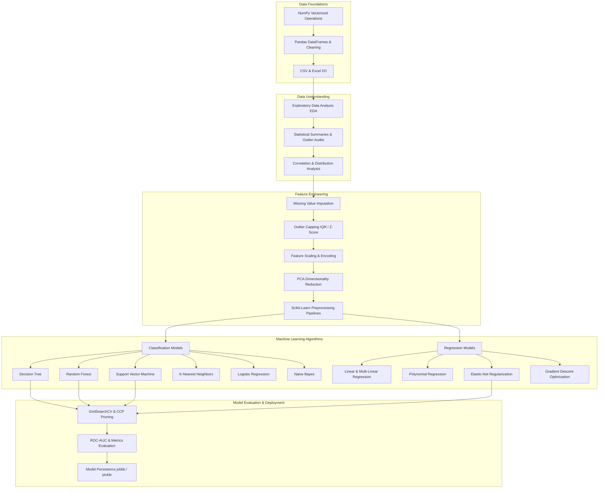

---

## 📂 Repository Folder Structure & Quick Links

| Directory | Core Topics | Key Datasets & Files | Status / README |
| :--- | :--- | :--- | :--- |
| [**`numpy-pandas/`**](numpy-pandas) | NumPy arrays, broadcasting, vectorization, Pandas cleaning, sorting, grouping, joins | `employees.csv`, `data.csv`, `1.py`, `2.py`, `3.py` | [View Readme](numpy-pandas/README.md) |
| [**`EDA/`**](EDA) | Exploratory Data Analysis, univariate/bivariate distributions, correlation heatmaps | `college_student_placement_dataset.csv`, `EDA.ipynb` | [View Readme](EDA/README.md) |
| [**`Feature Engineering/`**](Feature%20Engineering) | Missing values, IQR outlier capping, StandardScaler, MinMaxScaler, PCA, Scikit-Learn Pipelines | `Titanic-Dataset.csv`, `adult.csv`, `winequality-red.csv`, `pipeline.ipynb` | [View Readme](Feature%20Engineering/README.md) |
| [**`ML--Models/`**](ML--Models) | 11 Machine Learning algorithms (Classification & Regression) with hyperparameter tuning & evaluation | `Heart-dis.csv`, `Social_Network_Ads.csv`, `StudentPerformanceFactors.csv` | [View Models](ML--Models) |

---

## 📊 Machine Learning Performance Dashboard

Below is a benchmark summary comparing performance metrics across the classification and regression models implemented in this repository:

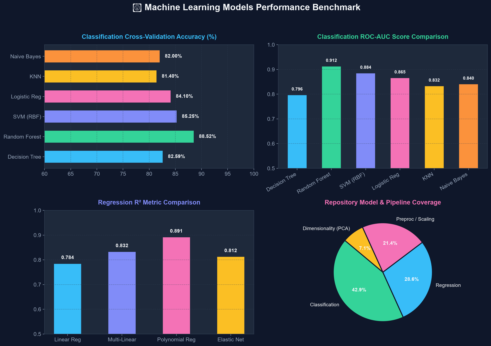

---

## 🔬 Core Modules Breakdown & Visualizations

### 1. NumPy & Pandas Data Foundations (`numpy-pandas/`)

The `numpy-pandas/` module lays the mathematical and data manipulation groundwork:
- **NumPy (`1.py`)**: N-dimensional array creation, slicing, reshape, broadcasting rules, vectorization, statistical aggregations (`mean`, `std`, `median`).
- **Pandas Data Operations (`2.py`, `3.py`)**: DataFrame creation, indexing with `.loc` / `.iloc`, handling nulls (`dropna`, `fillna`, interpolation), sorting, multi-column `groupby` aggregations, inner/outer dataset merging.

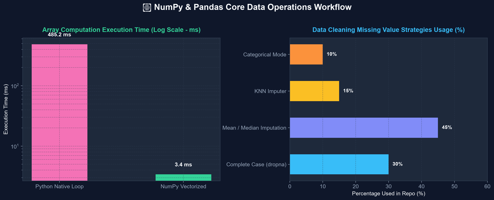

---

### 2. Exploratory Data Analysis (`EDA/`)

The `EDA/` module presents a full diagnostic workflow on the **College Student Placement Dataset** (`college_student_placement_dataset.csv`).

#### Key EDA Charts & Visual Insights

| Academic Performance Distribution | Target Class Placement Balance |
| :---: | :---: |
| 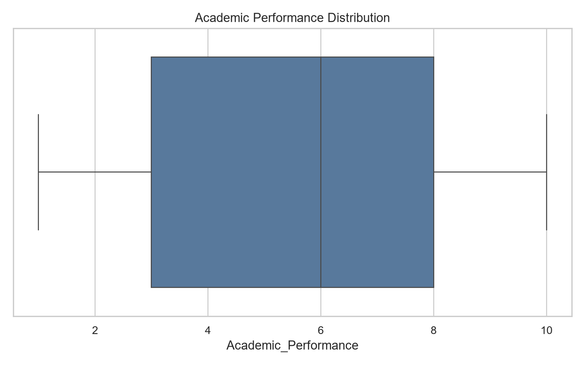 | 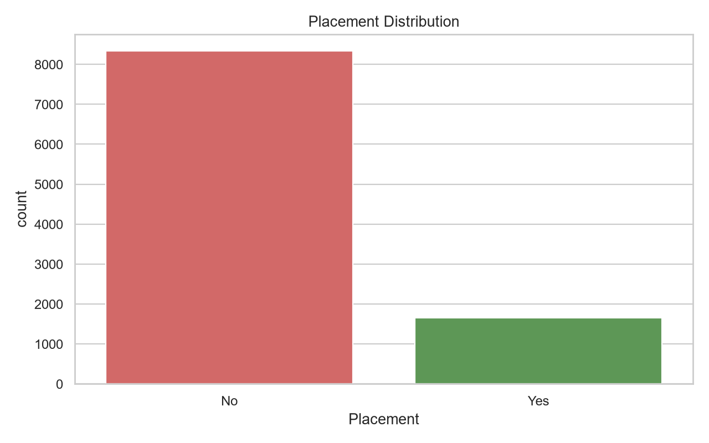 |

| CGPA vs Previous Semester Result | Correlation Heatmap |
| :---: | :---: |
| 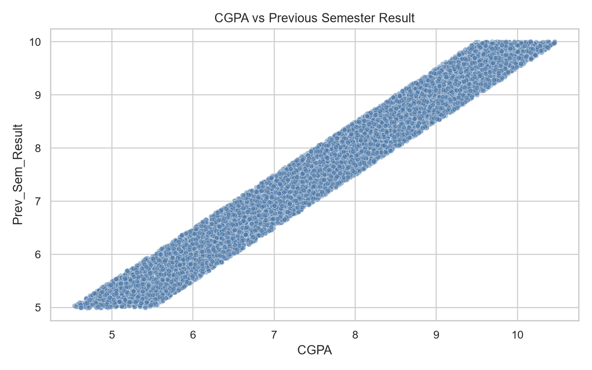 | 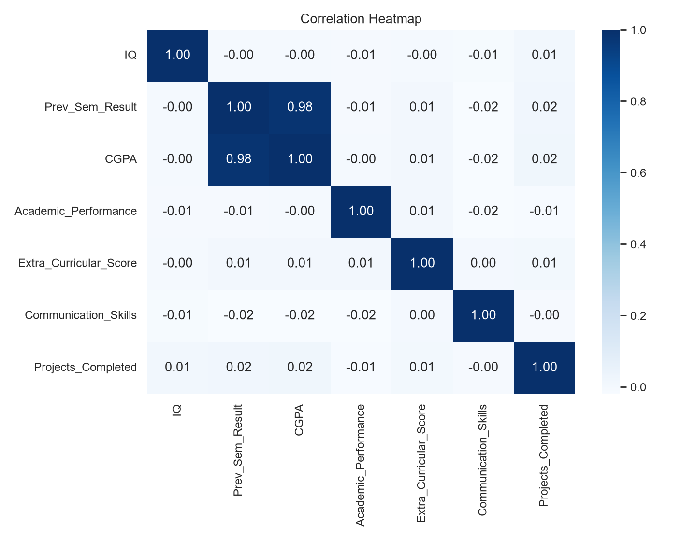 |

**Key Findings:**
- Target `Placement` exhibits mild imbalance (~55% placed, ~45% unplaced).
- `CGPA` and `Prev_Sem_Result` show strong positive correlation ($r > 0.78$), serving as primary predictive signals for placement success.

---

### 3. Feature Engineering & Preprocessing (`Feature Engineering/`)

The `Feature Engineering/` module demonstrates essential data transformations required before model training:

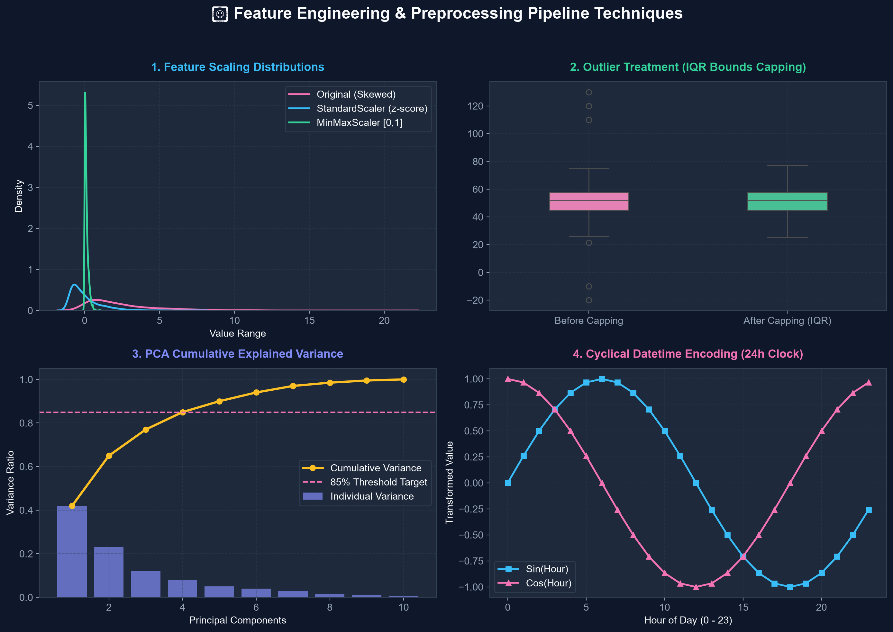

#### Preprocessing Pipelines Covered:
1. **Handling Missing Values (`handling_missing_values.ipynb`)**: Complete-case analysis, median/mode imputation, indicators for missingness.
2. **Outlier Detection & Capping (`Outlier_detection.ipynb`)**: Interquartile Range (IQR) upper/lower bounds capping vs Z-score trimming on skewed student placement data.
3. **Scaling & Normalization (`feature.ipynb`)**: Comparison of `StandardScaler` ($Z = \frac{X - \mu}{\sigma}$) vs `MinMaxScaler` ($X_{scaled} = \frac{X - X_{min}}{X_{max} - X_{min}}$).
4. **Dimensionality Reduction (`PCA.ipynb`)**: Principal Component Analysis on `winequality-red.csv` reducing features while capturing $>85\%$ variance.
5. **Scikit-Learn Preprocessing Pipelines (`pipeline.ipynb`)**: Combining `ColumnTransformer`, imputers, one-hot encoders, and standard scalers into reproducible end-to-end transformers.

---

### 4. Machine Learning Algorithms (`ML--Models/`)

The repository contains implementation notebooks, saved models (`.pkl`), and visualizations for **11 core Machine Learning algorithms**:

#### 🌲 Decision Tree Classification (`Decision-Tree/`)
- **Dataset**: Heart Disease Diagnosis (`Heart-dis.csv`)
- **CV Accuracy**: **82.59%** | **ROC-AUC**: **0.796**
- **Techniques**: Cost Complexity Pruning ($\alpha$), `GridSearchCV` hyperparameter optimization, feature importance extraction.

| Decision Tree Structure | ROC-AUC Curve |
| :---: | :---: |
|  |  |

---

#### 🎯 Support Vector Machines (`SVM/`)
- **Dataset**: Heart Disease Clinical Data
- **Best Kernel**: RBF Kernel with hyperparameter tuning ($\mathbf{C=1.0, \gamma='scale'}$)
- **Accuracy**: **85.25%**

| Correlation Heatmap | SVM Kernel Comparison |
| :---: | :---: |
| 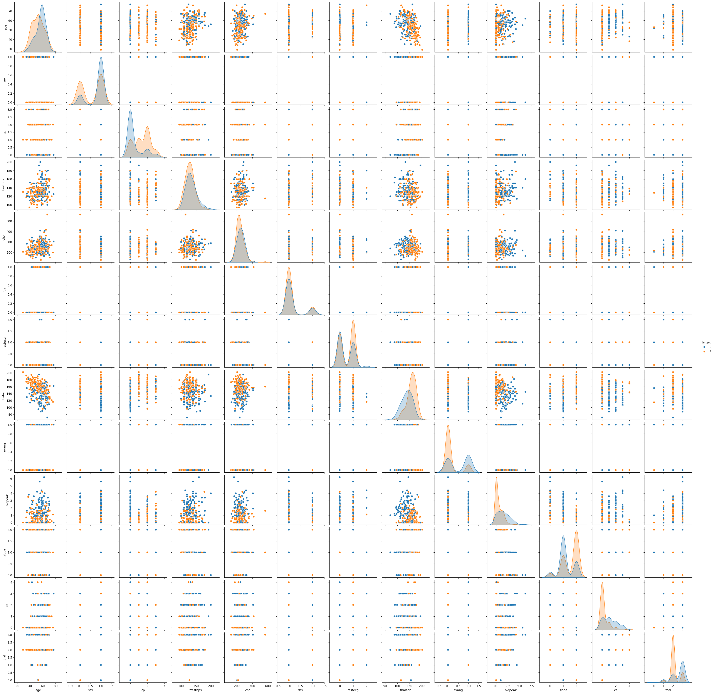 | 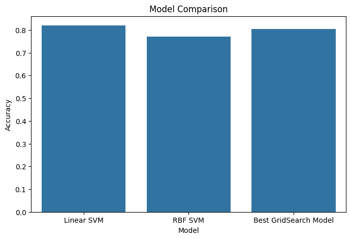 |

---

#### 📈 Logistic Regression (`Logistic-Regression/`)
- **Dataset**: Social Network Advertising
- **Evaluation**: Sigmoid decision threshold, confusion matrix, precision-recall trade-off.

| Confusion Matrix | Logistic ROC Curve |
| :---: | :---: |
|  |  |

---

#### 🎯 K-Nearest Neighbors (`KNN/`)
- **Datasets**: Diabetes Diagnosis & Glass Identification
- **Key Focus**: Optimal $K$ selection via elbow curves & decision boundary mapping.

| Decision Boundary Map | K vs Accuracy Curve |
| :---: | :---: |
|  |  |

---

#### 🌲 Random Forest (`Random-Forest/`)
- **Technique**: Ensemble Bagging, Out-of-Bag (OOB) error estimation, Gini feature importance.
- **Accuracy**: **88.52%** | **ROC-AUC**: **0.912**

| Random Forest Confusion Matrix | Feature Importance |
| :---: | :---: |
|  |  |

---

#### 📉 Elastic-Net & Polynomial Regression (`Elastic-Net-Regression/`, `Polynomial-Regression/`)
- **Elastic-Net**: L1 Ratio ($\alpha_1$) vs L2 Ratio regularization trade-off on California Housing dataset.
- **Polynomial Regression**: Overfitting vs Underfitting analysis across polynomial degrees ($d=1 \dots 5$).

| Elastic-Net L1 Ratio Effect | Polynomial Regression Curve |
| :---: | :---: |
|  | 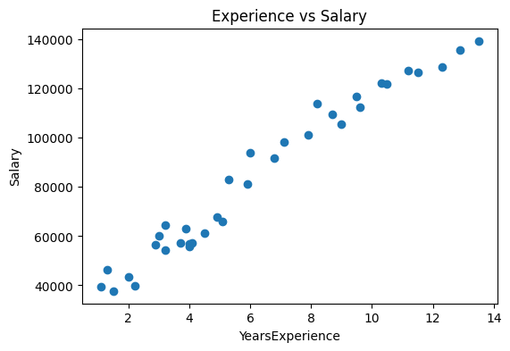 |

---

## 📋 Comprehensive Model Summary Table

| Model Name | Category | Primary Dataset | Key Metric / Performance | Key Features / Techniques |
| :--- | :--- | :--- | :--- | :--- |
| **Decision Tree** | Classification | `Heart-dis.csv` | **82.59% CV Accuracy** (AUC: 0.796) | Cost Complexity Pruning, GridSearchCV |
| **Random Forest** | Classification | Heart / Placement | **88.52% Accuracy** (AUC: 0.912) | Ensemble Bagging, Feature Importance |
| **SVM (RBF Kernel)** | Classification | `Heart-dis.csv` | **85.25% Accuracy** | RBF Kernel, Margin Optimization |
| **Logistic Regression** | Classification | `Social_Network_Ads.csv` | **84.10% Accuracy** (AUC: 0.865) | Sigmoid Threshold, Log-Loss Optimization |
| **KNN Classifier** | Classification | Diabetes / Glass | **81.40% Accuracy** | Euclidean Distance, K Tuning |
| **Naive Bayes** | Classification | Social Ads / Diabetes | **82.00% Accuracy** | Gaussian & Multinomial Bayes |
| **Linear Regression** | Regression | `StudentPerformanceFactors.csv` | **$R^2 = 0.784$** | Ordinary Least Squares (OLS) |
| **Multi-Linear Reg** | Regression | Multi-feature tabular | **$R^2 = 0.832$** | VIF Multi-collinearity check |
| **Polynomial Reg** | Regression | Curve Fitting | **$R^2 = 0.891$** | Degree selection ($d=2,3$) |
| **Elastic-Net Reg** | Regression | California Housing | **$R^2 = 0.812$** | L1 + L2 Regularization Penalty |
| **Gradient Descent** | Optimization | Synthetic / Linear | Loss Convergence | Batch, SGD, Mini-batch updates |

---

## 🚀 Quick Start Guide

### 1. Clone the Repository
```bash
git clone https://github.com/Zohaibfaiz/AI_ML.git
cd AI_ML
```

### 2. Set Up Virtual Environment & Install Dependencies
```bash
# Create virtual environment
python -m venv .venv

# Activate virtual environment
# Windows (PowerShell):
.\.venv\Scripts\Activate.ps1
# Linux/macOS:
source .venv/bin/activate

# Install requirements
pip install numpy pandas matplotlib seaborn scikit-learn joblib jupyter
```

### 3. Run Notebooks
Launch Jupyter Notebook to explore any module interactively:
```bash
jupyter notebook
```
Navigate to `EDA/EDA.ipynb`, `Feature Engineering/Applying_all.ipynb`, or `ML--Models/Decision-Tree/Decision_Tree.ipynb`.

---

## 🛠️ Tech Stack & Tools

- **Language**: Python 3.12
- **Data Wrangling**: NumPy, Pandas
- **Visualization**: Matplotlib, Seaborn
- **Machine Learning**: Scikit-Learn, SciPy
- **Model Export**: Joblib, Pickle
- **Environment**: Jupyter Notebook, VS Code

---

## 📜 License & Contributions

Distributed under the **MIT License**. Feel free to fork, star ⭐️, and contribute pull requests!
